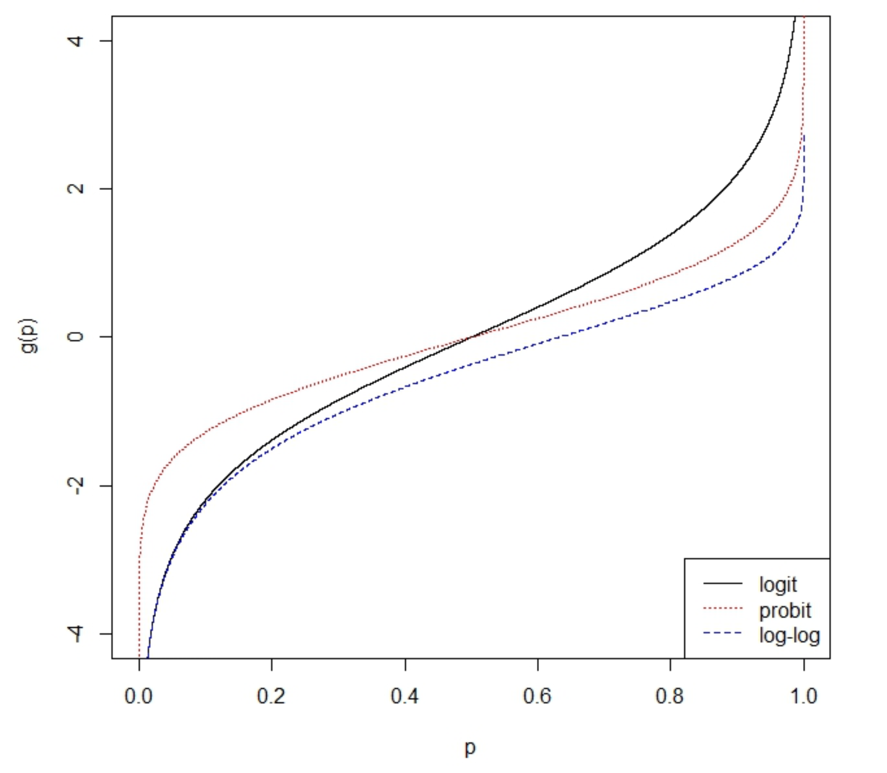

*Note*: hence we will use the form $\mu = X\beta$ with $\mu=\mathbb{E}(Y)$ for linear models, instead of $Y=X\beta+e$, because it is easier to generalize with the first form. Both are exactly the same, $Y \sim N(\mu, \sigma^2 \cdot Id)$.

##Motivation: example

*Objective*: to model the height, $Y$, of a plant as a function of the days, $X$, since it has been planted.

(1) First attempt: Linear model $Height = \beta_0 + \beta1 \cdot days + e$ it is not appropiate if a linear relation does not exist.
(2) Second attempt: Curvilinear model $log(Height)=\beta_0 + \beta1 \cdot days + e$ it assumes that $Height$ follows a Log-Normal distribution, and this may not be the case.

No podem utilitzar Models Lineals si **la resposta no és Normal** o si **l'esperança no és lineal amb les explicatives**. L'últim cas es pot donar quan una funció de $\mu$ és lineal amb les explicatives, però no la pròpia $\mu$. O sigui, la part que ajunta la part aleatòria amb la part determinista, no és exactament $\mu = X\beta$.

Thus, a modelization technique that allows simultaneously assume:

+ Normality for $Y$.
+ That a transformation of $\mu=\mathbb{E}(Y)$ in the covariates is linear.

is required. **Generalized Linear models** do that and *much more*! Since they allow that:

+ $Y$ follows a more general probability distribution, not necessarily Normal.
+ The linearity is between a transformation of $\mu$ and the covariates.

For the particular case of the example of the $Height$ of a plant, we need to assume:
$$
log(\mu) = \beta_0 + \beta_1 \cdot days
$$

where $\mu = \mathbb{E}(Y)$ and $Y$ is Normal distributed, and this can be done with *Generalized Linear Model* (*GLM*).

#Definition

A GLM has three components:

(1) **Random Component**: és el vector aleatori que segueix una distribució de probabilitat d'una familia de distribucions (veure la fórmula a sota) i les seves components han de ser independents, igual com passa en el model lineal. Si no hi ha independència de les components, no podem aplicar el GLM. Random vector $Y_{n \times 1}=(Y_1, Y_2, ..., Y_n)^t$,
$$
Y_i \sim e^{\frac{y\theta_i-b(\theta_i)}{a(\phi)}+c(y, \phi)}, \quad Y_i \sim exp\left(\frac{y\theta_i-b(\theta_i)}{a(\phi)}+c(y, \phi)\right)
$$

where $\theta_i$ changes by changing the covariates and $\phi$ is known as **dispersion parameter** also denoted by $\sigma^2$. $\mu_i=\mathbb{E}(Y_i)$ depends on $\theta_i$ and $\phi$.

(3) **Deterministic component**: que és la part lineal, igual que en el LM, la matriu del disseny. $X_{n\times p}\beta_{p \times 1}$, where $p < n$.
$$
\begin{pmatrix}
x_{11} & x_{12} & x_{13} & ...& x_{1p} \\ 
\vdots & \vdots & \vdots & \ddots & \vdots \\
x_{n1} & x_{n2} & x_{n3} & ...& x_{np}
\end{pmatrix}
\begin{pmatrix}
\beta_1 \\ 
 \vdots \\
\beta_p
\end{pmatrix}
$$
(4) **Link Function**: per enganxar les dues parts: la aleatòria amb la determinista. Any monotone differentiable function $\eta$ may be considered. És una funció del valor esperat de la part aleatòria, que ens relaciona el valor esperat amb la part determinista. The model is equal to:
$$
\eta = g(\mu) = X\beta, \quad  \mu = \mathbb{E}(Y)
$$

and each component of $Y$ verifies (1). Quan agafem la $g(\cdot)$ la identitat i distribució Normal, és un LM. Però els GLM explosionen en dues direccions: per una banda, podem agafar una $g(\cdot)$ qualsevol, que sigui monòtona diferenciable (= per poder invertir, derivada diferent de 0), i per altra banda, una distribució qualsevol de la familia de distribucions vista anteriorment.

## Random Component
La funció de densitat de la Normal és:
$$
f(y;\mu, \sigma)=\frac{1}{\sqrt{2\pi}\sigma}e^{-\frac{(y-\mu)^2}{2\sigma^2}}, \quad \mu=\mathbb{E}(Y), \quad \sigma^2=Var(Y)
$$

I depèn de dos paramètres: l'esperança i la variància. Recordem que en el model lineal, la propietat de *homocedasticity* ens demana que la igualtat de variàncies. En LM, l'esperança depèn de les explicatives, però la variància sempre és la mateixa. Per tant, en LM, si observem la observació $y_i$ sota les condicions experimentals i-èssimes, tindrem:
$$
f(y_i;\mu_i, \sigma)=\frac{1}{\sqrt{2\pi}\sigma}e^{-\frac{(y_i-\mu_i)^2}{2\sigma^2}}, \quad \mu_i=\mathbb{E}(y_i), \quad \sigma^2=Var(Y)
$$

Per tant, tenim dos paràmetres: $\mu_i$ que canvia segons les condicions experimentals i una $\sigma$ que és fixa. En el model generalitzat que tenim?
$$
Y_i \sim e^{\frac{y\theta_i-b(\theta_i)}{a(\phi)}+c(y, \phi)}, \quad Y_i \sim exp\left(\frac{y\theta_i-b(\theta_i)}{a(\phi)}+c(y, \phi)\right)
$$

També tenim que la $Y_i$ depèn de dos paràmetres: $\theta_i$ i $\phi$. Aquesta distribució s'anomena *Familia Exponencial de la Distribució de Probabilitat*, el paràmetre $\theta_i$ s'anomena **paràmetre Canònic de la Familia Exponencial** i és el que canvia quan canviem les condicions experimentals; i el paràmetre $\phi$ s'anomena **paràmetre de Dispersió** i és constant al llarg de tot l'experiment, és a dir, no canvia amb les condicions experimentals.

$\theta_i$ està relacionat amb $\mu_i$ i $\phi$ està relacionat amb $\sigma^2$.

### Normal
Anem a veure que la Normal pertany a la Familia Exponencial:
$$
f(y;\mu, \sigma)=\frac{1}{\sqrt{2\pi}\sigma}e^{-\frac{(y-\mu)^2}{2\sigma^2}}=e^{log\left(\frac{1}{\sqrt{2\pi}\sigma}\right)}e^{-\frac{(y-\mu)^2}{2\sigma^2}}=e^{-log\left(\sqrt{2\pi}\sigma\right)}e^{-\frac{(y^2-2y\mu +\mu^2)}{2\sigma^2}}=
$$
$$
e^{-\frac{1}{2\sigma^2}(y^2-2y\mu +\mu^2)-log\left(\sqrt{2\pi}\sigma\right)}=exp\left(-\frac{1}{2\sigma^2}(y^2-2y\mu +\mu^2)-log\left(\sqrt{2\pi}\sigma\right)\right)=exp\left(\frac{y\theta_i-b(\theta_i)}{a(\phi)}+c(y, \phi)\right)
$$

Primer de tot per identificar el paràmetre Canònic, mirem per què està multiplicada la $y$: 

$$
\exp \left( -\frac{y^2}{2\sigma^2}
+\frac{y\mu-\mu^2/2}{\sigma^2}
-log \left( \sqrt{2\pi}\sigma 
     \right) 
     \right)
=
\exp \left(
\frac{y\theta_i-b(\theta_i)}{a(\phi)}
+c(y, \phi)
      \right)
$$

Veiem que està multiplicada per $\theta_i=\mu$. Obserevem també que $a(\phi)=\sigma^2$ i que $b(\theta_i)=\mu^2/2$. Finalment ens queda $c(y,\phi)=-\frac{y^2}{2\sigma^2}-log\left(\sqrt{2\pi}\sigma\right)$. Per tant, naturalment, la distribució Normal pertany a la Familia Exponencial i es pot servir en els GLM's:
$$
\exp \left(
\frac{y\mu-\mu^2/2}{\sigma^2}
+ \left( - \frac{y^2}{2\sigma^2} - log \left(
\sqrt{2\pi}\sigma \right)
\right)
\right)
=
\exp\left(\frac{y\theta_i-b(\theta_i)}{a(\phi)}+c(y, \phi)\right)
$$

### Poisson

Podem fer servir la Poisson al GLM? La distribució de Poisson és la següent:
$$
f(y; \lambda) = e^{-\lambda}\frac{\lambda^y}{y!}
$$
$$
f(y; \lambda) = e^{-\lambda}\frac{\lambda^y}{y!}=f(y; \lambda) = e^{-\lambda}e^{log\left({\frac{\lambda^y}{y!}}\right)}
=e^{-\lambda}e^{log(\lambda^y)-log(y!)}
=e^{ylog(\lambda)-\lambda-log(y!)}=
$$
$$
exp\left(ylog(\lambda)-\lambda-log(y!)\right)=\exp \left(
\frac{y\theta_i-b(\theta_i)}{a(\phi)}
+c(y, \phi)
      \right)
$$

Observem:

+ Multiplicant la $y$ tenim: $\theta_i=log(\lambda)$, el paràmetre canònic.
+ Al denominador tenim $a(\phi) = 1$, el paràmetre de dispersió és 1.  
+ $b(\theta_i)=\lambda$, per posar-ho en funció de $\theta_i$: $b(\theta_i)=e^{\theta_i}$.
+ Finalment, $c(y,\phi)=-log(y!)$.

###Binomial

Binomial amb $n$ coneguda, tenim:
$$
f(y; p) = \binom{n}{y}p^y(1-p)^{n-y} = exp\left(log\binom{n}{y}+log(p^y)+log((1-p)^{n-y})\right)
$$
$$
exp\left(ylog(p)+(n-y)log(1-p)+log\binom{n}{y}\right)=
exp\left(y(log(p)-log(1-p))+nlog(1-p)+log\binom{n}{y}\right)
$$

Observem:

+ Multiplicant la $y$ tenim el logit: $\theta_i=log(p)-log(1-p)=log\left(\frac{p}{1-p}\right)$, el paràmetre canònic.
+ Al denominador tenim $a(\phi) = 1$, el paràmetre de dispersió és 1.  
+ $b(\theta_i) = nlog(1-p)$ per posar-ho en funció de $\theta_i$: 
$$
\theta_i=log\left(\frac{p}{1-p}\right) \iff e^{\theta_i}=\frac{p}{1-p}, \quad 1-p=1+\frac{p}{1-p}=1+e^{\theta_i}
$$
$$
b(\theta_i) = nlog(1-p) = nlog\left(1+e^{\theta_i}\right)
$$
+ Finalment, $c(y,\phi)=log\binom{n}{y}$.

###Gamma
Igual que en la Normal, com que té dos paràmetres, un paràmetre estarà relacionat amb el paràmetre canònic, i l'altre amb el paràmetre de dispersió.

$$
f(y; \alpha, \beta)=\frac{\beta^\alpha y^{\alpha-1}e^{-\beta y}}{\Gamma(\alpha)}=
\exp\left(log\left(\frac{\beta^\alpha y^{\alpha-1}e^{-\beta y}}{\Gamma(\alpha)}\right)\right)=
$$
$$
\exp\left(\alpha log\left(\beta\right)+(\alpha-1)log\left(y\right)-\beta y\cdot log\left(e\right)-log\left(\Gamma(\alpha)\right)\right)=
$$
$$
\exp\left(\alpha \left( log\left(\beta\right) -log\left(\alpha\right) + log\left(\alpha\right) \right)+(\alpha-1)log\left(y\right)-\beta y-log\left(\Gamma(\alpha)\right)\right)=
$$
$$
\exp\left(\alpha \left( log\left(\frac{\beta}{\alpha}\right) + \frac{-\beta y}{\alpha} \right)+(\alpha-1)log\left(y\right)-log\left(\Gamma(\alpha)\right)+ \alpha log\left(\alpha\right)\right)= 
$$
$$
\exp \left( 
\left( \frac{\frac{-\beta y}{\alpha}+log\left(\frac{\beta}{\alpha}\right)}{\frac{1}{\alpha}}\right)+(\alpha-1)log\left(y\right)-log\left(\Gamma(\alpha)\right)+ \alpha log\left(\alpha\right)\right)= 
\exp \left(
\frac{y\theta_i-b(\theta_i)}{a(\phi)}
+c(y, \phi)
      \right)
$$

Observem:

+ Multiplicant la $y$ tenim $\theta_i=\frac{-\beta}{\alpha}$, el paràmetre canònic.
+ Al denominador tenim $a(\phi) = \frac{1}{\alpha}=\alpha^{-1}=\phi$, el paràmetre de dispersió és 1. 
+ $b(\theta_i) = -log\left(\frac{\beta}{\alpha}\right)$ per posar-ho en funció de $\theta_i$:
$$
\frac{-\beta}{\alpha} = \theta_i \iff \frac{\beta}{\alpha} = -\theta_i, \quad b(\theta_i)=-log\left(-\theta_i\right)
$$

+ Finalment, $c(y,\phi)$:
$$
c(y,\phi)=(\alpha-1)log\left(y\right)-log\left(\Gamma(\alpha)\right)+ \alpha log\left(\alpha\right), \quad \phi = \alpha^{-1} \iff \phi^{-1}=\alpha
$$
$$
c(y,\phi)=(\phi^{-1}-1)log\left(y\right)-log\left(\Gamma(\phi^{-1})\right)+ \phi^{-1} log\left(\phi^{-1}\right)=
$$
$$
c(y,\phi)=\left(\frac{1}{\phi}-1\right)log\left(y\right)-log\left(\Gamma\left(\frac{1}{\phi}\right)\right)- \frac{log\left(\phi\right) }{\phi} 
$$

##Exponential
$$
f(y; \lambda)=\lambda e^{-\lambda y}= e^{-\lambda y + \log(\lambda)}
= exp(-\lambda y + \log(\lambda))=
\exp \left(
\frac{y\theta_i-b(\theta_i)}{a(\phi)}
+c(y, \phi)
      \right)
$$

Observem:

+ Multiplicant la $y$ tenim $-\lambda$: $\theta_i=-\lambda$, el paràmetre canònic.
+ Al denominador tenim $a(\phi) = 1$, el paràmetre de dispersió és 1.  
+ $b(\theta_i) = \log(\lambda)$ per posar-ho en funció de $\theta_i$: 
$$
\theta_i = -\lambda\iff \lambda=-\theta_i,\quad b(\theta_i)=\log(-\theta_i)
$$

+ Finalment, $c(y; \phi)=0$.

##Inverse Gaussian
$$
f(y; \mu, \lambda)=\exp\left(\frac{\frac{-1}{2\mu^2}y+\frac{1}{\mu}}{\frac{1}{\lambda}}-\frac{\lambda}{2y}+\frac{1}{2}\log(\lambda)-\frac{1}{2}\log(2\Pi y^3)\right)=
\exp \left(
\frac{y\theta_i-b(\theta_i)}{a(\phi)}
+c(y, \phi)
      \right)
$$

Observem:

+ Multiplicant la $y$ tenim $\frac{-1}{2\mu^2}$: $\theta_i=\frac{-1}{2\mu^2}$, el paràmetre canònic.
+ Al denominador tenim $a(\phi) = \frac{1}{\lambda}=\phi$, el paràmetre de dispersió és $\frac{1}{\lambda}$.  
+ $b(\theta_i) = \frac{1}{\mu}$ per posar-ho en funció de $\theta_i$: 
$$
\theta_i=-\frac{1}{2\mu^2} \iff \mu = \sqrt{-\frac{1}{2\theta_i}}, \quad b(\theta_i) = \frac{1}{\sqrt{-\frac{1}{2\theta_i}}}=\sqrt{-2\theta_i}
$$

*Observació*: no totes les distribucions pertanyen a la Familia Exponencial! Per exemple, les distribucions de Gumbel, Zipf no funcionen i no es poden utilitzar en el GLM.

*Nota:* a un GLM li corresponen dues funcions molt importants: el **link canònic** i la **funció variància**. Totes dues depenen de la distribució de probabilitat que triem, no depenen absolutament de la part determinista.

# Variance Function

La funció variància està relacionada amb la variància de la resposta. 

Calculem-la: si $Y \sim \exp \left(\frac{y\theta_i-b(\theta_i)}{a(\phi)}+c(y, \phi)\right)$, aleshores:
$$
I(\theta;y)=\frac{y\theta - b(\theta)}{a(\phi)}+c(y;\phi)
$$

Taking into account the properties of the score vector, one has that:
$$
0=\mathbb{E}\left(\frac{\partial I}{\partial \theta}\right)= 
\mathbb{E}\left(\frac{y-b^{'}(\theta)}{a(\phi)}\right) \iff \mathbb{E}(Y)=b^{'}(\theta)=\mu
$$
$$
\mathbb{E}\left(\frac{\partial^2 I}{\partial \theta^2}\right)=
-\mathbb{E}\left(\left(\frac{\partial I}{\partial \theta}\right)^2\right) \iff
\frac{b^{''}(\theta)}{a(\phi)}=\mathbb{E}\left(\frac{y-b^{'}(\theta)}{a(\phi)}\right)^2
\iff Var(Y)=a(\phi)b^{''}(\theta)
$$

La $\theta_i$ està íntimament lligada amb la $\mu$, i podem passar d'una a l'altra per un canvi de variable, per tant, la funció $V(\mu)=b^{''}(\theta)$ és la que s'anomena *funció variància* (**Variance Function**). Així, tenim que la variància de la variable resposta depèn de:

(1) El paràmetre de dispersió, $a(\phi)$.
(2) Una part que depèn del valor esperat: la funció variància, $V(\mu)$.
$$
Var(Y)=a(\phi)V(\mu)=a(\phi)b^{''}(\theta)
$$

**Important**: la hipòtesi de la *homocedasticity* o *igualtat de variàncies* - ha desaparegut, ja que, com que la $\mu$ canvia amb les condicions experimentals, la variància de la resposta, que depèn d'una funció de $\mu$ multiplicada pel paràmetre de dispersió - també canvia amb les condicions experimentals, no és fixa ni constant com en els LM, que era $\sigma^2$.
$$
\begin{array}{c|c|c|c}
Distribution&  \mathbb{E}_\theta(Y)=b^{'}(\theta) &Var_\theta(Y)=a(\phi)b^{''}(\theta) & V(\mu)\\
\hline
Normal        & \theta=\mu                        &  \sigma^2 & 1\\
Poisson       & e^\theta=\mu                      &  e^\theta = \mu & \mu\\
Binomial    & n\frac{e^\theta}{1+e^\theta}=np=\mu &  n\frac{e^\theta}{(1+e^\theta)^2}=np(1-p) & \mu(1-p)\\
Gamma         & -\frac{1}{\theta}=\mu             & \frac{1}{\theta^2}\phi=\mu^2\phi & \mu^2\\ 
Inv.Gaussiana & \frac{1}{\sqrt{-2\theta}}=\mu     & \frac{1}{(\sqrt{-2\theta})^3}\phi & \mu^3\\
\end{array}
$$

Únic cas que la variància és constant és la Normal. En tots els altres casos, com que la variància depèn del valor esperat, i el valor esperat canvia amb les condicions experimentals, la variància no és constant.

**Normal**:

$$
b(\theta)=\frac{\theta^2}{2}, \quad b'(\theta)=2\cdot\frac{\theta}{2}=\theta, \quad
b''(\theta)=1, \quad a(\phi)=\sigma^2=\phi
$$
$$
\mathbb{E}_\theta(Y)=b'(\theta)=\theta=\mu, \quad V(\mu)=b''(\theta)=1
$$
$$
Var(Y)=a(\phi)\cdot V(\mu)=\phi =\sigma^2
$$

**Poisson**:

$$
b(\theta)=e^{\theta}, \quad b'(\theta)=e^{\theta}, \quad
b''(\theta)=e^{\theta}, \quad a(\phi)=1=\phi
$$
$$
\mathbb{E}_\theta(Y)=b'(\theta)=e^{\theta}=\mu, \quad V(\mu)=b''(\theta)=e^{\theta}=\mu
$$
$$
Var(Y)=a(\phi)\cdot V(\mu)=\phi\cdot e^{\theta} =\mu
$$

**Binomial**:

$$
b(\theta)=n\log(1+e^\theta), \quad b'(\theta)=n\frac{e^\theta}{1+e^\theta}=np, \quad
b''(\theta)=n\frac{e^\theta}{(1+e^\theta)^2}=n\frac{e^\theta}{1+e^\theta}\cdot\left(1-\frac{e^\theta}{1+e^\theta}\right)=np(1-p)  
$$

$$
p=\frac{e^\theta}{1+e^\theta}, \quad a(\phi)=1=\phi
$$
$$
\mathbb{E}_\theta(Y)=b'(\theta)=n\frac{e^\theta}{1+e^\theta}=np=\mu, \quad V(\mu)=b''(\theta)=n\frac{e^\theta}{(1+e^\theta)^2}=np(1-p)
$$
$$
Var(Y)=a(\phi)\cdot V(\mu)=\phi\cdot n\frac{e^\theta}{(1+e^\theta)^2} =np(1-p)
$$

**Gamma**:

$$
b(\theta)=-\log(-\theta), \quad b'(\theta)=-\frac{1}{\theta}, \quad
b''(\theta)=\frac{1}{\theta}, \quad a(\phi)=\phi
$$
$$
\mathbb{E}_\theta(Y)=b'(\theta)=-\frac{1}{\theta}=\mu, \quad V(\mu)=b''(\theta)=\frac{1}{\theta}=\mu^2
$$
$$
Var(Y)=a(\phi)\cdot V(\mu)=\frac{\phi}{\theta} =\phi\mu^2
$$

**Inverse Gaussian**:

$$
b(\theta)=\sqrt{-2\theta}, \quad b'(\theta)=-\frac{1}{\sqrt{-2\theta}}, \quad
b''(\theta)=-\frac{1}{\sqrt{(-2\theta)^3}}, \quad a(\phi)=\phi
$$
$$
\mathbb{E}_\theta(Y)=b'(\theta)=-\frac{1}{\sqrt{-2\theta}}=\mu, \quad V(\mu)=b''(\theta)=-\frac{1}{\sqrt{(-2\theta)^3}}=\mu^3
$$
$$
Var(Y)=a(\phi)\cdot V(\mu)=-\frac{\phi}{\sqrt{(-2\theta)^3}} =\phi\mu^3
$$

#Canonical Link
La funció $\eta$ tal que passa de la $\mu$ al paràmtere canònic $\eta=g(\mu)=\theta$ s'anomena **funció link canònic** o **link canònic**.
$$
\begin{array}{c|c|c}
Distribution&  \mathbb{E}_\theta(Y)=b^{'}(\theta)=\mu & Canonical \quad Link \\
\hline
Normal        & \theta=\mu                        &  \mu \\
Poisson       & e^\theta=\mu                      &  log(\mu) \\
Binomial/n    & n\frac{e^\theta}{1+e^\theta} & log\left(\frac{\mu}{n-\mu}\right)\\
Gamma         & -\frac{1}{\theta}=\mu             & -\frac{1}{\mu} \\ 
Inv.Gaussiana & -\frac{1}{\sqrt{-2\theta}}=\mu     & \frac{1}{\mu^2} \\
\end{array}
$$

**Normal**:
$$
\mathbb{E}_\theta(Y)=\theta=\mu \iff \theta=g(\mu)=\mu \quad g(\cdot)=identity
$$

**Poisson**:
$$
\mathbb{E}_\theta(Y)=e^{\theta}=\mu \iff \theta=g(\mu)=\log(\mu) \quad g(\cdot)=\log
$$

**Binomial**:
$$
\mathbb{E}_\theta(Y)=n\frac{e^\theta}{1+e^\theta}=np=\mu \iff \theta=g(\mu)=\log\left(\frac{\frac{\mu}{n}}{1-\frac{\mu}{n}}\right)=
\log\left(\frac{p}{1-p}\right)=
\log\left(\frac{\mu}{n-\mu}\right)\quad g(\cdot)=logit
$$

**Gamma**:
$$
\mathbb{E}_\theta(Y)=-\frac{1}{\theta}=\mu \iff \theta=g(\mu)=-\mu^{-1} \quad g(\cdot)=-mult.inverse
$$

**Inverse Gaussian**:
$$
\mathbb{E}_\theta(Y)=-\frac{1}{\sqrt{-2\theta}}=\mu \iff \theta=g(\mu)=\frac{\mu^{-2}}{2}= \frac{1}{2\mu^{2}}
$$

Utilitzar el link canònic, $g(\mu)=X\beta$, comporta alguns avantatges:

+ $y^tX$ és un *estadístic suficient*. Això vol dir que tota la informació que conté $Y$ respecte del paràmetre està continguda en aquest producte.
+ Trobar les $\beta$'s en el GLM és molt més complicat, i només es poden trobar numèricament, no hi ha cap expresió explícita per la $\hat{\beta}$ màxim versemblant. Amb el link canònic, é més fàcil de trobar-les (menys càlculs).
+ El model és més fàcil d'interpretar.

## Maximum Likelihood Estimator of $\beta$

+ En el LM, per trobar $\hat{\beta}=(X^tX)^{-1}X^tY$ i és explícit.
+ En el GLM, $\hat{\beta} \approx (X^tWX)^{-1}X^tWZ$ és numèric, es calcula mitjançant un procés iteratiu (*mínims quadrats ponderats*). $W$ és una matriu diagonal amb pesos.

To find the m.l.e. of the parameter vector $\beta$, the following iterative equation has to be solved:
$$
X^tWXb^{m+1}=X^tWZ
$$
Which is equivalent to an iterative **weighted least squares**. Where:
$$
w_{ii}=\frac{1}{Var(Y_i)}\left(\frac{\partial\mu_i}{\partial\eta_i}\right)^2 ,\quad W_{ij}=0 \quad if \quad i\ne j 
$$

and
$$
z_i=\sum_{j=1}^p x_{ij}b_j^m+(y_i-\mu_i)\frac{\partial\eta_i}{\partial\mu_i}
$$

Per tenir una idea de la complexitat per trobar el màxim versemblant en un GLM, cada iteració es pot descriure mitjançant el següent esquema:
$$
\beta^m \rightarrow X\beta^m=\eta\rightarrow \mu\rightarrow \theta=g(\mu)  \rightarrow Var(Y) \rightarrow \left\{ \begin{array}{ll}
         W\\
        Z\end{array} \right. 
        \rightarrow \beta^{m+1}
$$

Comencem amb una $\beta^m$ inicial, multipliquem per $X$ i obtenim $\eta$. A continuació, invertim la $g(\cdot)$ i tindrem la $\mu$. *Observació*: invertir una funció és computacionalment molt costós i ho haurem de fer tantes vegades com compornents té el vector $Y$! Un cop tenim la $\mu$, fàcilment passem al paràmetre canònic $theta$ i aleshores calulem la funció variància. A partir d'aquí, calculem $W$ i $Z$ i obtenim $\beta^{m+1}$. Aquesta $\beta^{m+1}$ la posem al principi de la cadena i tornem a multiplicat per $X$ i tornem a tenir $\eta$ i etc. (A cada iteració és fa per cada component de $Y$).

*Important notes*:

+ **Amb quina $\beta$ comencem?** El valor inicial comencem amb una $\mu_o$ inicial, que és el vector $Y$. Podem assumir que és el vector dels valors esperats: què esperem trobar? El que hem vist. I així s'engega el procés.
+ **Si fem servir el link canònic**, el model queda $\theta=X\beta$ si el link és canònic, i en aquest cas, en multiplicar la $\beta$ per $X$ tenim la $\theta$ directament i ens estalviem els primers dos passos. Per això, amb el link canònic, computacionalment és molt més ràpid i no hem d'invertir la $g(\cdot)$. Però no estem obligats a modelar amb el link canònic.

## Predicted Values

Un cop obtinguda $\hat{\beta}$, els valors predits esperats equivalen a:
$$
\hat{y}=\hat{\mu}=g^{-1}(X\hat{\beta})
$$

## Null and Full models. Definitions

(1) **Null model**: és el model qeu només té un paràmetre (*intercept*). Per tant, no hi ha explicatives - la resposta és la mateixa per a tothom. Les condicions experimentals no afecten a la resposta. Tothom igual ($g(\mu)=\beta_0$). La resposta és constant, és el model més senxill de tots i, evidentment, és el que anirà pitjor de tots.
(2) **Full model**: o *model complet*, és el millor model. És el que té tants paràmetres com observacions. Prediu exactament les mateixes observacions que tenim, o sigui, la predicció serà idèntica a la observació que hàgim obtingut en aquelles condicions experimentals. És un model perfecte, però tan perfecte com inútil, perquè nosaltres volem un model que amb pocs paràmetres expliqui el que està passant. The fit obtained with the full model is the *perfect fit* (té un *ajust perfecte*).

Nosaltres busquem un model entre mig, que expliqui bastant bé, la major part de la variabilitat, i que utilitzi menys paràmetres. És a dir, un model que estigui molt a la vora del *full model* i molt lluny del *null model*.

## Goodness of fit measures: Scaled Deviance
Let $l(\hat{\mu}, \phi;y)$ and $l(y, \phi; y)$ be the values of the *log-likelihood* corresponding to our model and the full model, respectively.

The **scaled deviance** is defined as:
$$
D^*(y;\hat{\mu})=2(l(y;y)-l(\hat{\mu};y))
$$

On $y$ és el nostre vector resposta i $\hat{\mu}$ són els predits pel nostre model.
$l(y;y)$ log-versembalnça quan els fitted són el mateix que els observed.
$l(\hat{\mu};y)$ quan els fitted són els que ha donat el nostre model. Com que volem estar a la vora del full model, volem que $D^*(y;\hat{\mu})$ sigui petit.

**El valor de $D^*(y;\hat{\mu})$ sempre serà positiu?** Sí, perquè el valor de la log-versemblança del model full, que és el model perfecte, sempre serà més gran que en el nostre model, que és l'aproximat. Si $D^*(y;\hat{\mu})$ és molt gran, vol dir que no arribem al model full, no ens apropem bastant i que el nostre model no és molt bo. Si és petit, no rebutjarem el model, perquè és bo: amb pocs paràmtres arribem a una log-versemblança semblant a la del model full. 

To compare: $H_0: our \space \space model$ VS $H_1: full \space \space model$, one has that under $H_0$, assimptotically $D^*(y;\hat{\mu}) \sim \chi_{n-p}^2$, where $p$ is the number of parameters of our model.

So, one rejects $H_0$ when $D^*(y;\hat{\mu}) \geq \chi_{\alpha, n-p}^2$.
No cal dir, que moltes vegades rebutjarem aquesta hipòtesi, perquè demanar que el nostre model sigui tan bo com el full - és demanar molt...

**Què és la Versemblança i la log-Versemblança?** Assumim que el nostre vector $Y$ segueix una distribució de probabilitat (Normal, Poisson, Binomial...) i tenim varies observacions. La versemblança és una funció que depèn de la nostra mostra i dels paràmetres de la distribució i el qpot mesurar dues coses:

+ *Quant probable és observar la nostra mostra donats uns determinats paràmetres i una distribució coneguda?* En aquest cas, servim la notació: $L(y_1, y_2,..., y_n;\lambda)= L(y_1, y_2,..., y_n|\lambda)$
+ O, *quins són els paràmetres que maximitzen la proabilitat que una mostra coneguda provingui d'una distribució amb aquests paràmetres?* El que volem és estimar els paràmetres de forma que es maximitzi la probabilitat i la notació és: $L(\lambda;y_1, y_2,..., y_n)= L(\lambda|y_1, y_2,..., y_n)$

*Exemple*: imaginem que estem en una Poisson. I hem obtingut una observació $y=3$. Quant versemblant és observar $y=3$ en una $Poisson(\lambda)$? Com estimarem $\lambda$? Agafarem una $\lambda$ que fa màxima aquesta probabilitat. I si agafem la $\lambda$ que ho maximitza, aquell serà el paràmetre màxim versemblnat:
$$
L(\lambda;y=3)=e^{-\lambda}\frac{\lambda^3}{3!}
$$

Com que el màxim de la funció de versemblança és el mateix que el del logaritme (=perquè el logaritme és una funció creixent), en lloc de maximitzar la versemblança, podem maximitzar la log-versemblança, perquè tenen el mateix màxim i treballar amb el logaritme és més fàcil. Per tant, en l'exemple de la Poisson, la log-versemblança:
$$
l(\lambda;y=3)=-\lambda+3log(\lambda)-log(3!)
$$

Quin és el màxim del log-versemblant? Hem de derivar $l(\lambda;y=3)$:
$$
\frac{\partial l}{\partial \lambda}=0 \rightarrow \frac{3}{\hat{\lambda}}-1=0\iff \hat{\lambda}=3
$$

Qualsevol altre paràmetre fa menys probable que aquestes dades provinguin d'una Poisson.

$\hat{\lambda}=3$ és el màxim versemblant. **Quant val la log-versemblança quan l'avaluem en l'estimador màxim versemblant?** La log-versemblança del màxim versemblant és:
$$
l(y=3;\hat{\lambda}=3)=-3+3log(3)-log(3!)=-1.49
$$
I el que obtenim és el logaritme de la probabilitat que l'observació $y=3$ provingui d'una Poisson amb paràmetre $\lambda=3$. No ens extranyem que el número que ens ha sortit és negatiu: les log-versemblances sempre són negatives, perquè la probabilitat és un número entre 0 i 1! La probabilitat és: $L(y=3;\hat{\lambda}=3)=e^{-1.49}=0.224$.

*Exemple*: primer, escriu l'expressió del màxim versemblant de $Y\sim Poisson(\lambda)$ essent $Y=y_1,y_2,...,y_n$ mostres independents. 
$$
L(y_1, y_2,..., y_n;\lambda)=\prod_{i=1}^n\left(e^{-\lambda} \frac{\lambda^{y_i}}{y_i!}\right)
=e^{-n\lambda}\frac{\lambda^{\sum_{i=1}^n y_i}}{y_1!\cdot y_2!\cdot...\cdot y_n!}
$$

Segon, sabent que $\lambda=3$ és el paràmetre de la Poisson, quant versemblant és que la mostra (=aquestes dades) $1,2,4,2,7$ ($n=5$) provingui d'una $\sim Poisson(\lambda=3)$?
$$
L(1,2,4,2,7;3) =e^{-15}\frac{3^{16}}{1!\cdot2!\cdot4!\cdot2!\cdot7!}=0.000027
$$

Tercer, quin és el paràmetre $\lambda$ que maximitza la probabilitat que una mostra coneguda provingui d'una Poisson (estimació del paràmetre màxim versemblant)?
$$
l(\lambda;y_1, y_2,..., y_n)= \log\left(\prod_{i=1}^n\left(e^{-\lambda} \frac{\lambda^{y_i}}{y_i!}\right)\right)=
-n\lambda+\log(\lambda)\sum_{i=1}^n y_i-\sum_{i=1}^n \log(y_i!)
$$

Maximitzem:
$$
\frac{\partial l}{\partial \lambda}=0 \rightarrow 
-n+\frac{1}{\lambda}\sum_{i=1}^n y_i=0\rightarrow 
\frac{1}{\lambda}=\frac{n}{\sum_{i=1}^n y_i}\rightarrow 
\hat{\lambda}=\frac{\sum_{i=1}^n y_i}{n}=\bar{y}
$$

La mitjana aritmètica correspon al paràmetre $\lambda$ màxim versemblant de la Poisson. Així, si la mitjana de les dades és $7.8$, és més probable que provingui d'una $\sim Poisson(7.8)$.

*Exemple*: escriure el màxim versemblant d'una $Bin(n,p)$. Trobar el màxim versemblant de $p$.

In maximum likelihood estimation, you are trying to maximize $L(p;x)={n\choose x}p^x(1-p)^{n-x}$; however, maximizing this is equivalent to maximizing $p^x(1-p)^{n-x}$ for a fixed $x$.
$$L(p;x_1, x_2,..., x_m)=\prod_{i=1}^mp^{x_i}(1-p)^{n-x_i} = p^{\sum_1^m x_i}(1-p)^{\sum_1^mn-x_i} = p^{x}(1-p)^{n-x}$$
Why does the constant go away? Informally, and what most people do, is just notice that the leading constant does not affect the value of $p$ that maximizes the likelihood, so we just ignore it (we can effectively set it to 1).

We can derive this by taking the log of the likelihood function and finding where its derivative is zero:

$$l(p;x_1, x_2,..., x_m)=\log\left({n\choose x}p^x(1-p)^{n-x}\right) = \log{n\choose x}+x\log(p)+(n-x)\log(1-p)$$

Take derivative with respect to $p$ and set to $0$:

$$\frac{d}{dp}\log{n\choose x}+x\log(p)+(n-x)\log(1-p) = \frac{x}{p}- \frac{n-x}{1-p} = 0$$

$$\implies x-xp-np+xp=0 \implies\frac{n}{x} = \frac{1}{p} \implies p = \frac{x}{n}$$

Notice that the leading constant dropped out of the calculation of the MLE.

*Exemple*: (**model amb covariables, $\beta$'s màxim versemblants i càlcul de la Deviància de la Poisson**): ara imaginem que estem fent un model Lineal Generalitzat on la resposta és discreta de tipus Poisson. El nostre vector resposta $Y \sim Poisson(\lambda)$ ($\lambda = \mu$). El link canònic per la Poisson és el logaritme: $\log(\mu)=X\beta \iff \mu = e^{X\beta}$. Aquí no volem trobar la $\lambda$, sinó que volem trobar les $\beta$'s perquè cadascú té les seves condicions experimentals. Com que és un GLM i en un GLM sempre assumim que les components són independents, cada $Y_i \sim Poisson(\lambda_i)$, no tots de la mateixa $\lambda$!

Per exemple, si estem modelant amb una Poisson quants germans té una persona en funció de l'edat dels seus pares, on les variables explicatives són $X_1=$l'edat del pare i $X_2=$l'edat de la mare, les persones l'edat dels pares dels quals coincideixi, els modelarà la mateixa $\lambda_i$; tot i que tinguin un número de germans diferent, com que l'edat dels pares coincideix, el model predirà el mateix per l'un i per l'altre.

Així doncs, 
$$
L(\lambda;y_1, y_2,..., y_n)=\prod_{i=1}^n\left(e^{-\lambda_i} \frac{\lambda_i^{y_i}}{y_i!}\right)
=\prod_{i=1}^ne^{-\lambda_i} \cdot \prod_{i=1}^n \lambda_i^{y_i}\cdot \prod_{i=1}^n\frac{1}{y_i!}
$$
$$
l(\hat{\lambda};y_1, y_2,..., y_n)
=-\sum_{i=1}^n\hat{\lambda}_i + \sum_{i=1}^n y_i\log(\hat{\lambda}_i)- \sum_{i=1}^n\log(y_i!)
$$

Això seria la log-Versemblança si les nostres dades provenen d'una Poisson i cada component d'una Poisson diferent, per cada una té la seva $\lambda_i$. Ara, si voldriem trobar el màxim no respecte $\lambda$, sinó el màxim respecte les $\beta$'s, hauriem de trobar què lliga la $\lambda_i$ amb les $\beta$'s: $\log(\mu_i)=X_i\beta \iff \mu_i = e^{X_i\beta}$, l'exponencial de la fila $i$ pel vector $\beta$:
$$
\hat{\mu}_i=\hat{\lambda}_i=e^{\sum_{j=1}^p x_{ij}\hat{\beta}_j}
$$
$$
l(\hat{\beta};y_1, y_2,..., y_n)
=-\sum_{i=1}^ne^{\sum_{j=1}^p x_{ij}\hat{\beta}_j} + \sum_{i=1}^n y_i\sum_{j=1}^p x_{ij}\hat{\beta}_j
- \sum_{i=1}^n\log(y_i!)
$$

**Quant val la log-Versemblança en el full model?** Com que el predit és exactament igual a l'observat, i per això: $\hat{\lambda}_i=y_i$:
$$
l(\hat{\lambda}_{full};y_1, y_2,..., y_n)
=-\sum_{i=1}^ny_i + \sum_{i=1}^n y_i\log(y_i)- \sum_{i=1}^n\log(y_i!)
$$

I la Deviància escalada:
$$
D^*(y;\hat{\mu})=2(l(\hat{\lambda}_{full};y_1, y_2,..., y_n)-l(\hat{\lambda}_i;y_1, y_2,..., y_n))
$$
$$
l(\hat{\lambda}_{full};y_1, y_2,..., y_n)-l(\hat{\lambda}_i;y_1, y_2,..., y_n)=
-\sum_{i=1}^ny_i + \sum_{i=1}^n y_i\log(y_i)- \sum_{i=1}^n\log(y_i!)
+\sum_{i=1}^n\hat{\lambda}_i - \sum_{i=1}^n y_i\log(\hat{\lambda}_i)+ \sum_{i=1}^n\log(y_i!)
$$

$$
=
-\sum_{i=1}^ny_i+\sum_{i=1}^n\hat{\lambda}_i 
+ \sum_{i=1}^n y_i\log(y_i)- \sum_{i=1}^n y_i\log(\hat{\lambda}_i)=
-\sum_{i=1}^n(y_i-\hat{\lambda}_i) 
+ \sum_{i=1}^n y_i \log\left(\frac{y_i}{\hat{\lambda}_i}\right)
$$
$$
D^*(y;\hat{\mu})=2\sum_{i=1}^n\left[y_i \log\left(\frac{y_i}{\hat{\lambda}_i}\right)+(y_i-\hat{\lambda}_i) \right]
$$

## Goodness of fit measures: Deviance
In general, when $a(\phi)=\frac{\phi}{w_i}$, which in the case of the Normal, Poisson and Binomial distributions, for instance, $w_i=1$ and $a(\phi)=\phi$. The scaled deviance can be defined as $D^*(y;\mu)=\frac{D(y;\mu)}{\phi}$, and the function $D(y;\mu)$ is known as **deviance**:
$$
D(y;\mu)=D^*(y;\mu)\cdot \phi
$$

For the Poisson and the Binomial distributions ($\phi=1$), the deviance and the scaled deviance are equal: $D(y;\mu)=D^*(y;\mu)\cdot 1=D^*(y;\mu)$.

For the Normal distribution ($\phi=\sigma^2$), the scaled deviance is the deviance divided by $\sigma^2$: $D^*(y;\mu)=\frac{D(y;\mu)}{\sigma^2}$.

For the Gamma distribution, the scaled deviance is equal to the deviance multiplied by one of the parameters of the distribution:

$$
\begin{array}{c|c}
Distribution&  Deviance \\
\hline
Normal        & \sum_{i=1}^n  (y_i-\hat{\mu}_i)^2 \\      
Poisson       &  2\sum_{i=1}^n\left(y_i\log\left(\frac{y_i}{\hat{\mu}_i}\right)-(y_i-\hat{\mu}_i)\right) \\
Binomial    &  2\sum_{i=1}^n\left(y_i\log\left(\frac{y_i}{\hat{\mu}_i}+(n-y_i)\log\left(\frac{(n-y_i)}{(n-\hat{\mu}_i)}\right)\right)\right)\\
Gamma         & 2\sum_{i=1}^n\left(-\log\left(\frac{y_i}{\hat{\mu}_i}\right)+\frac{(y_i-\hat{\mu}_i)}{\hat{\mu}_i}\right)  \\ 
Inv.Gaussiana &  \sum_{i=1}^n\frac{(y_i-\hat{\mu}_i)^2}{(\hat{\mu}_i^2y_i)}\\
\end{array}
$$

La deviància per la Normal és el mateix que els mínims quadrats (RSS). Quan en el model linela demanem que la suma de quadrats sigui mínima, és el mateix que dir que volem la deviància mínima. Per tant, **la deviància és una generalització de la suma de quadrats residual (RSS)**. Si la suma de quadrats és molt petita (= deviància petita) el model és bo, perquè els *fitted* i els *predicted* estan molt a la vora. Això té sentit quan hi ha Normalitat. Quan no tenim Normalitat, deixa de tenir sentit minimitzar la funció $\sum_{i=1}^n(y_i-\hat{\mu_i})^2$! La que té sentit minimitzar és la funció de deviància, i per cada distribució, és diferent.

En el cas de la Poisson, volem que la diferència $(y_i-\hat{\mu_i})$ sigui petita, però també demanem que la raó $\frac{y_i}{\hat{\mu}_i}$ també sigui petita! no només volem que l'observat i el predit estiguin a la vora, però també volem que la raó en escala també sigui petita (aprox. 1 i logaritme de 1 és 0). Si hi ha un, que la raó és gran, la deviància ja se'ns dispara - és com si la distribució Poisson fos més exigent.

En el cas de la Binomial, estem observant l'observat i el predit en escala logarítmica: $y_i$ són els èxits que hem trobat i $\hat{\mu_i}$ són els èxits que prediu el nostre model;  $n-y_i$ són els fracassos que hem trobat i $n-\hat{\mu_i}$ són els fracassos que prediu el nostre model. No només estem demanant que els èxits predits estiguin a la vora dels èxits observats, sinó que també demanem que els fracassos predits estiguin a la vora dels fracassos observats.

En el cas de la Gamma: volem que estigui a la vora la raó de l'observat i el predit, però a la vegada tenim la discrepància $(y_i-\hat{\mu_i})$ dividida pel valor esperat.

I en el cas de la Inversa Gaussiana, tenim la discrepància $(y_i-\hat{\mu_i})$ escalada per $\hat{\mu}_i^2y_i$.

## Goodness of fit measures: $X^2$ generalized Pearson Statistic

El $X^2$ de Pearson generalitzat es defineix com el sumatori dels observats menys predits al quadrat partit per la funció Variància de cada $\hat{\mu}_i$ (=estandaritzem i per això dividim per una cosa que està relacionada amb la variància del model). Cada observació contribueix una quantitat en aquest sumatori:
$$
X^2= \sum_{i=1}^n\frac{(y_i-\hat{\mu_i})^2}{V(\hat{\mu}_i)}=\sum_{i=1}^n(r_p(y_i))^2
$$

El **residu de Pearson** es defineix com:
$$
r_p(y_i)=\frac{y_i-\hat{\mu}_i}{\sqrt{V(\hat{\mu}_i)}}
$$

En el cas de Normalitat, si $Y_i\sim N(\mu;\sigma)$, $V(\mu_i)=1, \forall i$; i per tant $r_p(y_i)=y_i-\hat{\mu}_i, \forall i$ (=raw residuals) i l'estadístic de Pearson és equivalent a la suma de quadrats residual: $X^2=\sum_{i=1}^n(r_p(y_i))^2=\sum_{i=1}^n(y_i-\hat{\mu}_i)^2$.

Voldrem un $X^2$ petit; un $X^2$ petit implica que el nostre model és bo. Si el nostre model és apropiat i $a(\phi)=\phi$, la distribució asimptòtica de $\frac{X^2}{\phi}$ és una $\chi^2$ amb $n-p$ graus de llibertat. Per tant, rebutgem el nostre model quan $X^2 \geq \chi^2_{\alpha, n-p}$.

## Residuals
Pearson residual:
$$
r_p(y_i)=\frac{y_i-\hat{\mu}_i}{\sqrt{V(\hat{\mu}_i)}}
$$

Deviance residual:
$$
r_D=sign(y_i-\hat{\mu}_i)\cdot d_i
$$

It is verified that: $D(y; \mu)=\sum_{i=1}^n d^2_i$.

Asimptòticament, aquest dos residus són gairebé iguals, és a dir, si tenim moltes dades - no hi haurà moltes diferències entre els dos residus.

## Dispersion parameter estimation
En el cas de la Normal, $\phi = \sigma^2$. L'estimació de $\sigma^2$, $\hat{\sigma}^2$:
$$
\hat{\phi}=\hat{\sigma}^2= \frac{RSS}{N-p}=\frac{\sum_{i=1}^N (y_i-\hat{\mu}_i)^2}{N-p}=\frac{X^2}{N-p}
$$

En el cas de la Poisson o Binomial, $\phi = 1$. I per tant: $\hat{\phi} \simeq 1$. Però! La Poisson assumeix que els esdeveniments passen de forma independent, però a la vida passa que els esdeveniments normalment tenen una cerat depèndencia, les dades venen agrupades i passa que la variància és més gran que la que realment tocaria a una Poisson. Aquest fenomen s'anomena **Sobredispersió** (*Overdispersion*) i això és que la nostra mostra té més variabilitat que la que tocaria si realment provingués d'una Poisson. *Underdispersion* és molt menys freqüent, però és simètric, això és que les nostres dades tenen molta menys variabilitat de la que tocaria si relament provinguèssin d'una Poisson.

**Com mirem en GLM si tenim Overdispersion?** De la següent manera, si en una Poisson la $\phi = 1$, i la variància és igual a l'esperança ($V(\hat{\mu}_i)=\mu_i$), com ens queda $X^2$ de Pearson?
$$
X^2 = \frac{\sum_{i=1}^N (y_i-\hat{\mu}_i)^2}{\mu_i}
$$

Si $\phi = 1$ i les nostres dades són realment Poisson, $X^2$ ha de venir de $\sim \chi^2_{N-p}$, si el model és apropiat:
$$
X^2 = \frac{\sum_{i=1}^N (y_i-\hat{\mu}_i)^2}{\mu_i}\sim \chi^2_{N-p}
$$

L'esperança d'una $\chi^2$ són els seus graus de llibertat, per tant, com que l'estadístic de Perason segueix una $\chi^2$ de $N-p$ graus de llibertat, $\mathbb{E}(X^2)=n-p$; i si el model és s'ha de complir:
$$
\frac{X^2}{N-p} \simeq 1
$$

Si el model és apropiat, ha de donar a la vora de  1. Si surt molt més gran que 1, el model Poisson no va bé. Com que moltes vegades $Var(Y)=\phi\cdot\mu$ ($\phi\geq1$) i no $Var(Y)=V(\mu)=\mu$ ($\phi=1$), suposem (ja no és Poisson!):
$$
X^2 = \frac{\sum_{i=1}^N (y_i-\hat{\mu}_i)^2}{\phi\mu_i}
$$
$$
\frac{X^2}{\phi(N-p)} \simeq 1 \rightarrow \tilde{\phi}=\frac{X^2}{N-p}
$$

Així estimem el paràmetre de dispersió en el cas Poisson i Binomial. Si aquest quocient surt molt més gran que 1, això ens està dient que el model Poisson no és apropiat i que tenim *Sobredispersió*.

## Comparison of two nested models
The scaled deviance allows to compare two **nested models**. *Definition*: given two models, $mod_1$ and $mod_2$, it is said that $mod_1$ is **nested** in $mod_2$ if, and only if, $mod_2$ contains all the parameters of $mod_1$ and some more. Denote $p_i$ the number of parameters of $mod_i$. Say $Y \sim exp.\space family$:
$$
mod_1:\quad g(\mu) = X\beta, \quad \beta_{p_1} \quad with\quad p_1 \quad parameters
$$
$$
mod_2:\quad g(\mu) = X\beta, \quad \beta_{p_2} \quad with\quad p_2 \quad parameters
$$

En el model 2 afegim la interacció i volem decidir quin model triem com a bo: volem determinar si cal la pena utilitzar la interacció (tenim guany? n'és evident?). **Com comparem aquests dos models?**

+ Si la interacció surt no significativa, vol dir que no calia aquest paràmetre i per tant, ens quedem amb el model 1.
+ Però si la interacció surt significativa... Val la pena modelar amb un paràmetre més pel guany que tenim? El guany és important per tal de justificar un paràmetre més? Cal un model més complex?
+ Si el guany és important, evidentment afegim un paràmetre més. Però si el guany és petit, podem decidir estalviar-nos un paràmetre més i així el model queda més senzill i més fàcil d'interpretar sense interacció.

**Hi ha uns quants criteris de selecció entre dos models:**

(1) *Criteri de selecció per log-Versemblances*: fem la log-Versemblança de la $\hat{\beta}_{mod_1}$ i la log-Versemblança de la $\hat{\beta}_{mod_2}$. Com recordem, la Versemblança és quant probable que les nostres dades provinguin del model amb aquesta $\hat{\beta}$. El model que doni una log-Versemblança més gran, és el millor model.
$$
l(\hat{\beta}_{mod_1};y_1, y_2,..., y_n) \quad  vs  \quad l(\hat{\beta}_{mod_2};y_1, y_2,..., y_n)
$$

Ens quedem amb el model que tingui una log-Versemblança més gran en el màxim versemblant, perquè vol dir que les nostres dades són més probables en aquest model. Però aquest primer criteri de selecció no té en compte el nombre de paràmetres dels models. Potser la log-versemblança sigui més gran, però al mateix temps pot tenir 6 paràmetres més i aleshores aquest criteri no és una justificació.

(2) *AIC: Akaike's An Information Criterion*: el Criteri d'Informació d'Akaike es defineix com:
$$
AIC = -2(\hat{\beta};y_1, y_2,..., y_n)+2p
$$

on $p$ és el nombre de paràmetres. Menys dues vegades la log-Versemblança en el màxim versemblant més dues vegades el nombre de paràmetres. El millor model és el que la log-Versemblança més gran; si multipliquem per 2, vol dir que el millor tindrà aquest terme més petit i $+2p$ penalitza si la $p$ és molt gran (= si hi ha molts paràmetres). Encara que el primer terme sigui petit, si hi ha molts paràmetres; se suma una penalització doble. Entre dos models, el millor model és aquell que té mínim AIC.

(3) *Test d'hipòtesi que permet triar entre dos models aniuats*: denotem $D_i$ la deviància escalada del model $mod_i$. Per contrastar $H_0:mod_1$ vs $H_1:mod_2$ (el segon és el que té més paràmetres!), utilitzem la diferència de les deviàncies que, sota $H_0$, asimptòticament, segueix un $\chi^2$ amb $p_2-p_1$ graus de llibertat:
$$
D_1 - D_2 \sim \chi^2_{p_2-p_1}
$$

Aquell 2 que posavem en la fòrmula de la Deviància el necessitavem perquè segueixi la $\chi^2$. Rebutgem $H_0$ quan $D_1-D_2\geq\chi^2_{\alpha,p_2-p_1}$. En base d'això, decidim si agafem el model que té més paràmetres o menys.

# Test de Tukey
Explicarem en què consisteix i com es fa el *Test de Tukey* utilitzant un exemple de *One-way Anova*. Tenim una variable resposta, $Y$ "renda per càpita", i una variable explicativa categòrica, $X$ "país". Quan fem un model lineal amb un factor, el primer nivell (= el primer país) el posem com a *baseline*. Si algún dels paràmetres és estadíticament diferent de zero, per exemple, si el país 3 ens dóna que és estadísticament diferent de 0 (= baseline) vol dir que la renda per càpita del país 3 és diferent que la renda per càpita del país 1. Si és negatiu - és que és més baixa, si és positiu - és que és més alta. L'*Omnibus Test* el que ens diu és si el *País*, com a variable explicativa, explica una part important de les diferències que observem en la renda per càpita (=si rebutgem és que sí, hi ha diferències en la renda per càpita en països diferents). Ara que hem determinat que hi ha diferències entre països diferents, la pregunta natural que se'ns pot ocórrer és:

+ **On són les veritables diferències quan sabem que realment hi ha algunes diferències? Podem determinar grups sencers estadísticament diferents o no entre ells?**

Sempre comparem les diferències amb el *baseline*, i si volguèssim juntar els països en grups on estadísticament no veiem diferències significatives? El *Test de Tukey* ens permet esbrinar quines parelles, quins grups de nivells, són estadísticament diferents i quins no.

*Test de Tukey*:

$N$ és el nombre total de dades; $p$ és el nombre total de paràmetres del model. Amb una categòrica tenim $a$ nivells: $p=\beta_0+(a-1)=a$ paràmetres.$\bar{Y}_{i}$ és la mitjana de les dades del país $i$, i $\bar{Y}$ és la mitjana de totes les dades, la mitjana general. 
$$
\begin{array}{c|c|c}
Level&  Observations & Mean \\
\hline
1   & y_{11}, y_{12}, ..., y_{1n}    &  \bar{Y}_{1} \\
2   & y_{21}, y_{22}, ..., y_{2n}    &  \bar{Y}_{2} \\
3   & y_{31}, y_{32}, ..., y_{3n}    & \bar{Y}_{3}\\
\vdots   & \vdots    & \vdots \\ 
a   & y_{a1}, y_{a2}, ..., y_{an}    & \bar{Y}_{a} \\
\end{array}
$$

(1) Ordenar les mitjanes de menor a major (creixentment): $\bar{Y}_{(1)}, \bar{Y}_{(2)},..., \bar{Y}_{(a)}$, $(i)$ representa la posició en aquesta ordenació.
(2) Estimar la variància de les mitjanes $S^2_{\bar{Y}_k}$. L'estimació estàndard que obtindrem ens servirà per a totes les files:
$$
S^2_{\bar{Y}_k}=\frac{\hat{\sigma}^2}{n}=\frac{RSS}{N-p}\cdot\frac{1}{n}=\frac{RSS}{N-a}\cdot\frac{1}{n}
$$

On $n$ és el número d'observacions per cada nivell. Això és així si tenim el mateix número d'observacions per cada nivell, però **què passa si tenim un número diferent d'observacions per cada nivell?** Una $\bar{Y}_i$ serà una mitjana de 7, una altra de de 4, etc. Quina $n$ agafem?
$$
\begin{array}{c|c|c}
Level&  Observations & Mean \\
\hline
1   & y_{11}, y_{12}, ..., y_{1n_1}    &  \bar{Y}_{1} \\
2   & y_{21}, y_{22}, ..., y_{2n_2}    &  \bar{Y}_{2} \\
3   & y_{31}, y_{32}, ..., y_{3n_3}    & \bar{Y}_{3}\\
\vdots   & \vdots    & \vdots \\ 
a   & y_{a1}, y_{a2}, ..., y_{an_a}    & \bar{Y}_{a} \\
\end{array}
$$

En aquest cas, haurem d'agafar la mitjana harmónica $n_h$ (*harmonic mean*):
$$
n_h = \frac{a}{\frac{1}{n_1}+\frac{1}{n_2}+...+\frac{1}{n_a}}
$$
$$
S^2_{\bar{Y}_k}=\frac{RSS}{N-a}\cdot\frac{1}{n_h}
$$

(3) Buscar a la **Taula de la Distribució del Rang de Student** (*Studentized Range Distribution*) el valor $q_\alpha(a, N-a)$, on $\alpha$ és el nivell de significació, $a$ és el nombre de nivells dels factor i $N-a$ és el nombre de graus de llibertat de l'error.
(4) Comencem a comparar (+ Regla de la Divisió): $H_0: \mu_i = \mu_j$ vs $H_1: \mu_i \ne \mu_j$, la mitjana del nivell $i$ és la mateixa que la mitjana del nivell $j$? O són diferents? Si es compleix:
$$
|\bar{Y}_i-\bar{Y}_j|\geq q_\alpha(a, N-a)\cdot S_{\bar{Y}_k}
$$

rebutgem $H_0$ (= les mitjanes no són estadísticament iguals). $S_{\bar{Y}_k} = \sqrt{S^2_{\bar{Y}_k}}$; *observació*:$S_{\bar{Y}_k}$ no depèn en absolut de $\bar{Y}_i$.

(5) Comencem a comparar utilitzant la Regla de la Divisió del pas (4):
$$
|\bar{Y}_{(a)}-\bar{Y}_{(1)}|\geq q_\alpha(a, N-a)\cdot S_{\bar{Y}_k}
$$

Si no es compleix, totes les mitjanes són iguals. Si es compleix, rebutgem $H_0$, és a dir, les mitjanes de $\bar{Y}_{(1)}$ i $\bar{Y}_{(a)}$ són diferents. En aquest cas continuem amb el següent, en ordre:
$$
|\bar{Y}_{(a)}-\bar{Y}_{(2)}|\geq q_\alpha(a, N-a)\cdot S_{\bar{Y}_k}
$$

Si es compleix, significa que $\bar{Y}_{(2)}$ i $\bar{Y}_{(a)}$ són estadísticament diferents. Si no, vol dir que $\bar{Y}_{(2)}$ i $\bar{Y}_{(a)}$ són estadísticament equivalents. Si resulta que $\bar{Y}_{(3)}$ també és estadísticament equivalent a $\bar{Y}_{(a)}$ ja no cal continuar, com que anem en ordre, la resta també serà estadísticament equivalent a $\bar{Y}_{(a)}$. En aquest cas, tindriem dos grups formats: $\bar{Y}_{(1)}$ i $\bar{Y}_{(2)}, ..., \bar{Y}_{(a)}$.

Si rebutgèssim $\bar{Y}_{(1)}$ i $\bar{Y}_{(3)}$ i no $\bar{Y}_{(2)}$, aleshores hauriem de comprovar si $\bar{Y}_{(1)}$ i $\bar{Y}_{(2)}$ formen grup o no. Es podria donar-se el cas de tenir 3 grups; observeu que els grups es poden solapar. En cas que $\bar{Y}_{(1)}$ i $\bar{Y}_{(2)}$ formèssin grup:
$$
\bar{Y}_{(1)}, \bar{Y}_{(2)}, \bar{Y}_{(3)}, \bar{Y}_{(4)}, ..., \bar{Y}_{(a)}
$$

Si l'*Omnibus Test* ha donat significatiu, segur que trobarem alguna diferència en el test de Tukey (com a mínim, hi haurà una parelleta estadísticament diferent).

Si ens surt que no es veuen diferències significatives entre $\bar{Y}_{(1)}$ i $\bar{Y}_{(2)}$ i entre $\bar{Y}_{(2)}$ i $\bar{Y}_{(3)}$, però entre $\bar{Y}_{(1)}$ i $\bar{Y}_{(3)}$, es pot interpretar com, per exemple, el nivell de mates de l'estudiant (1) i l'estudiant (2) és semblant i entre els estudiants (2) i (3) també es semblnat, però hi ha una diferència considerable entre el nivell de mates de (1) i (3).

*Exemple*: realitzar el *Test de Tukey* amb les dades que es proporcionen:
$$
N=40, n=8, RSS=784.9
$$
$$
\begin{array}{c|c|c}
Level&  Observations & Mean \\
\hline
1   & y_{11}, y_{12}, ..., y_{18}    &  \bar{Y}_{1}=37.9 \\
2   & y_{21}, y_{22}, ..., y_{28}    &  \bar{Y}_{2}=64.7 \\
3   & y_{31}, y_{32}, ..., y_{38}    & \bar{Y}_{3}=29.0\\
4   & y_{41}, y_{42}, ..., y_{48}    & \bar{Y}_{4}=45.7 \\
5   & y_{51}, y_{52}, ..., y_{58}    & \bar{Y}_{5}=30.8 \\
\end{array}
$$

(1) Ordenem les mitjanes:
$$
\bar{Y}_{(1)}=\bar{Y}_{3}=29.0; \bar{Y}_{(2)}=\bar{Y}_{5}=30.8; \bar{Y}_{(3)}=\bar{Y}_{1}=37.9; \bar{Y}_{(4)}=\bar{Y}_{4}=45.7; \bar{Y}_{(5)}=\bar{Y}_{2}=64.7
$$

(2) Estimem la variància de les mitjanes $S^2_{\bar{Y}_k}$:
$$
S^2_{\bar{Y}_k}=\frac{\hat{\sigma}^2}{n}=\frac{RSS}{N-p}\cdot\frac{1}{n}=
\frac{784.9}{40-5}\cdot\frac{1}{8}=2.803
$$

L'error estàndard és:
$$
S_{\bar{Y}_k} = \sqrt{S^2_{\bar{Y}_k}}=\sqrt{2.803}=1.6743
$$

(3) Busquem a la Taula del Rang de Student el valor $q_{0.05}(5, 40-5)$, que és $=4.0660$.

(4) Calculem el valor amb el que compararem $q_{0.05}(5, 40-5)\cdot S_{\bar{Y}_k}=4.0660 \cdot 1.6743=6.8076$.

(5) Ara comencem a comparar:

+ $\bar{Y}_{(5)}$ vs $\bar{Y}_{(1)}$: $|64.7-29.0|=35.7\geq 6.8076$, rebutgem (=no són iguals).
+ $\bar{Y}_{(5)}$ vs $\bar{Y}_{(2)}$: $|64.7-30.8|=33.9\geq 6.8076$, rebutgem (=no són iguals).
+ $\bar{Y}_{(5)}$ vs $\bar{Y}_{(3)}$: $|64.7-37.9|=26.8\geq 6.8076$, rebutgem (=no són iguals).
+ $\bar{Y}_{(5)}$ vs $\bar{Y}_{(4)}$: $|64.7-45.7|=19.0\geq 6.8076$, rebutgem (=no són iguals).

+ $\bar{Y}_{(4)}$ vs $\bar{Y}_{(1)}$: $|45.7-29.0|=16.7\geq 6.8076$, rebutgem (=no són iguals).
+ $\bar{Y}_{(4)}$ vs $\bar{Y}_{(2)}$: $|45.7-30.8|=14.9\geq 6.8076$, rebutgem (=no són iguals).
+ $\bar{Y}_{(4)}$ vs $\bar{Y}_{(3)}$: $|45.7-37.9|=7.8\geq 6.8076$, rebutgem (=no són iguals).

+ $\bar{Y}_{(3)}$ vs $\bar{Y}_{(1)}$: $|37.9-29.0|=8.9\geq 6.8076$, rebutgem (=no són iguals).
+ $\bar{Y}_{(3)}$ vs $\bar{Y}_{(2)}$: $|37.9-30.8|=7.1\geq 6.8076$, rebutgem (=no són iguals).

+ $\bar{Y}_{(2)}$ vs $\bar{Y}_{(1)}$: $|30.8-29.0|=1.8\geq 6.8076$, NO rebutgem (= són IGUALS).

S'observen 4 grups: $\bar{Y}_{(1)}, \bar{Y}_{(2)}; \bar{Y}_{(3)}; \bar{Y}_{(4)}; \bar{Y}_{(5)}$
$$
\bar{Y}_{3},\bar{Y}_{5};\bar{Y}_{1}; \bar{Y}_{4}; \bar{Y}_{2}
$$

Ara, imaginem que estem en un *Two-way Anova*. Tenim dos factors i els dos són significatius. Llavors, ajustem el model amb interacció, per veure si la interacció és significativa o no. I ens surt que la interacció és significativa. Ara bé, tot és important, però... podriem fer alguna cosa semblant a Tukey per saber si hi ha algún grup de mitjanes que no són estadísticament diferents?

Per exemple, si les dues categòriques són *Espècie* i *Adob* i la resposta és l'*Àrea*, podria passar que no hi haguèssin diferències en l'àrea si posem l'adob en les espècies 3 i 4, però si amb l'espècie 8. O, si pensem ara en files i no en columnes, si a l'espècie 2 li posem adob 6 o 9 no hi ha diferències, però si li posem l'adob 1 - l'àres és més gran.

**Què fem si volem fer Tukey però tenim interacció?**
$$
\begin{array}{c|c|c|c|c|c}
Level&  1 & 2 & ... & b & Species \\
\hline
1   &&&&&  \bar{Y}_{1j} \\
\hline
2   &&&&&  \bar{Y}_{2j} \\
\hline
3   &&&&& \bar{Y}_{3j}\\
\hline
\vdots &&&&& \vdots \\ 
\hline
a   &&&&& \bar{Y}_{aj} \\
\hline
Compost &\bar{Y}_{i1}&\bar{Y}_{i2}&...&\bar{Y}_{ib}&\bar{Y}_{ij}
\end{array}
$$

$\bar{Y}_{1j}$ representa que hem fixat la fila $1$ i estem fent la mitjana movent la $j$. $\bar{Y}_{ij}$ és la mitjana de tota la taula: $\bar{Y}_{ij}=\frac{1}{N}\sum_i\sum_jY_{ij}$. SI no hi hagués interacció, podriem fer primer Tukey per files i després Tukey per columnes, i no hi ha cap problema; però com que hi ha **interacció** això no seria correcte. Si hi ha interacció:

(1) *Tukey per comparar files (+Interracció)*: per cada columna, fem un Tukey, comparant les mitjanes de les files. Si fem per totes les columnes, en total fariem $b$ Tukey's, un per cada nivell columna. Les conclusions que tindriem serien:
$$
\begin{array}{c|c|c|c|c|c}
Level&  1 & 2 & ... & b & Species \\
\hline
1   &&&&&  \bar{Y}_{1j} \\
\hline
2   &&&&&  \bar{Y}_{2j} \\
\hline
3   &&&&& \bar{Y}_{3j}\\
\hline
\vdots &&&&& \vdots \\ 
\hline
a   &&&&& \bar{Y}_{aj} \\
\hline
Compost &\bar{Y}_{i1}&\bar{Y}_{i2}&...&\bar{Y}_{ib}&\bar{Y}_{ij}
\end{array}
$$
Si l'adob que penses posar és l'adob 1, estadísticament en l'àrea no hi haurà diferències entre les espècies 1 i 2. En canvi, si l'adob que posem és l'adob 2, estadísticament si que hi ha diferències entre l'espècie 1 i l'espècie 2.

(2) *Tukey per comparar columnes (+Interracció)*: per simetria - per cada fila, fem un Tukey, comparant les mitjanes de les columnes Si fem per totes les files, en total fariem $a$ Tukey's, un per cada nivell fila. Les conclusions serien:
$$
\begin{array}{c|c|c|c|c|c}
Level&  1 & 2 & ... & b & Species \\
\hline
1   &&&&&  \bar{Y}_{1j} \\
\hline
2   &&&&&  \bar{Y}_{2j} \\
\hline
3   &&&&& \bar{Y}_{3j}\\
\hline
\vdots &&&&& \vdots \\ 
\hline
a   &&&&& \bar{Y}_{aj} \\
\hline
Compost &\bar{Y}_{i1}&\bar{Y}_{i2}&...&\bar{Y}_{ib}&\bar{Y}_{ij}
\end{array}
$$
Si hem decidit plantar l'espècie 2, quin adob posem? On estan les diferències?

En total, si tenim interacció, se'ns complica la feina i hem de fer en total $a\times b$ Tukey's.

## Levene Test
$$
\begin{array}{c|c|c|c}
Level&  Observations & Mean& Variance \\
\hline
1   & y_{11}, y_{12}, ..., y_{1n_1}    &  \bar{Y}_{1}& S^2_1 \\
2   & y_{21}, y_{22}, ..., y_{2n_2}    &  \bar{Y}_{2}& S^2_2 \\
3   & y_{31}, y_{32}, ..., y_{3n_3}    & \bar{Y}_{3}& S^2_3\\
\vdots   & \vdots    & \vdots& \vdots \\ 
a   & y_{a1}, y_{a2}, ..., y_{an_a}    & \bar{Y}_{a}& S^2_a \\
\end{array}
$$
El test de Levene ens permet comprovar si hi ha igualtat de variàncies (=si hi ha homocedasticity):
$$
H_0: \sigma^2_1 = \sigma^2_2=...=\sigma^2_a
$$
$$
H_1: \exists i,j \quad s.t. \quad \sigma^2_i \ne \sigma^2_j
$$

L'estadístic de prova és:
$$
W=\frac{\sum_{i=1}^a (\bar{Y}_i-\bar{Y})^2}{\sum_{i=1}^a\sum_{j=1}^{n_i}(Y_{ij}-\bar{Y_i})^2}\cdot \frac{N-a}{n-1}=
\frac{\frac{\sum_{i=1}^a (\bar{Y}_i-\bar{Y})^2}{n-1}}{\frac{\sum_{i=1}^a\sum_{j=1}^{n_i}(Y_{ij}-\bar{Y_i})^2}{N-a}}
$$

I la distribució de referència és de Fisher. Rebutgem $H_0$ si (Regla de divisió):
$$
W \geq F_{\alpha, a-1, N-a}
$$

És una generalització del *test de Fisher per comparar dues variàncies*. Si $a=2$, Fisher i Levenne valen el mateix.

## Summary of the Generalized Linear Model

(1) GLM ens permet modelar $\mu=\mathbb{E}(Y)$ com a funció de covariables, relaxant les hipòtesis de normalitat i igualtat de variàncies (=homocedasticity) del model lineal. No obstnat, requereix:

+ Que la distribució de $Y$ vingui donada en forma exponencial.
+ Una funció link especificada.

(2) En la teoria de GLM, la hipòtesi de la independència de les observacions segueix sent necessària. En un GLM tenim tres components:

+ *Component aleatòria*, que és la distribució de probabilitat de les $Y$'s, que ha pertanyer a la Familia Exponencial.
+ *Component determinista*, igual que en els models lineals, és la $X\beta$.
+ *Link function*, que ens lliga les dues components anteriors; ha de ser una funció monòtona i invertible.

(3) Cada distribució de probabilitat té associades dues funcions importants: el *link canònic* i la *funció variància* (la variància en un GLM depèn de $\mu$; si la $\mu$ cambia, la variància també). El paràmetre de dispersió ($\phi$) és el que fa el paper de $\sigma^2$ dels models lineals.

(4) Podem fer estimació puntual de $\beta$ que s'obté *"iteratively weighted least squares"* i, asimptòticament, $\hat{\beta}$ segueix una distribució Normal.

(5) Tenim dues mesures de *goodness-of-fit*: la Deviància i $X^2$ l'estadístic de Pearson Generalitzat. Asimptòticament són equivalents. La Deviància, a més, ens permet comparar dos models aniuats.

(6) L'estimació del paràmetre de dispersió ($\tilde{\phi}$) es fa dividint $X^2$ entre els seus graus de llibertat.

(7) Cadascuna d'aquestes mesures ens presenta un tipus de residu (els residus de la Deviància i els residus de Pearson). Asimptòticament els residus de les dues són Normals. 

# Models for Binary response
Si la nostra variables resposta és Binomial (em observats èxits i fracassos), es pot posar com a Familia Exponencial i es pot utilitzar en el GLM. Comencem amb un exemple: estem interessats en comparar diferents dosis d'insecticida repecte la mortalitat d'un insecte. Tenim només una explicativa, que és la dosi d'insecticida que hem subministrat. Tenim $m$ grups diferents amb $n_i$ insectes cadascún. Observem una mortalitat total de $Y_i$ produïda per la $i$-èssima dosi:
$$
\begin{array}{c|c|c}
x_i&  n_i & y_i \\
\hline
0.75   & 90    &  0 \\
1.5   & 80    &  2 \\
3   & 90    & 4\\
6   & 60    & 13 \\
7.5   & 85    & 27 \\
10   & 60    &  32 \\
15   & 90    &  55 \\
20   & 60    & 44\\
50   & 50    & 47 \\
100   & 40    & 38 \\
\end{array}
$$

El més normal és esperar que en augmentar la dosi, s'augmenti la mortalitat, però té sentit pensar que a partir d'una certa dosi, tot és ja tan tòxic que encara que augmentem més, estarem allà mateix.
Això respon correctament al sigmoide del *logit*: amb dosi petita - mortalitat petita, després veiem un creixement lineal on notem la mortalitat a mida que anem augmentant la dosi, i al final quan la dosi és molt gran, la mortalitat quasi no canvia perquè és massa tòxic. 

La interpretació de $p_i$ és la probabilitat de morir si s'inserta la dosi $i$. Si estimem la probabilitat de morir amb la dosi $i$, $\hat{p}_i$, sota el model complet (=full model, ens estima 10 paràmetres, les 10 proabilitats per cada dosi), la seva estimació serà: $\hat{p}_i=\frac{y_i}{n_i}$.

Però nosaltres volem un model no amb 10 paràmetres (tants paràmetres com observacions), sinó que volem un model amb només dos paràmetres:

(1) **Experimental units**: insectes.
(2) **Variables**:
+ $Y$ nombre de morta sota una dosi donada (variable resposta discreta).
+ $X$ nivell de dosi de l'insecticida (variable explicativa continua).
(3) **Condicions experimetals**: cada dosi de l'insecticida considerada.
$$
Y_i \sim Bin(n_i, p_i)
$$
$$
\begin{pmatrix}
\log\left(\frac{p_1}{1-p_1}\right) \\ 
\log\left(\frac{p_2}{1-p_2}\right) \\ 
\log\left(\frac{p_3}{1-p_3}\right)
\\ \vdots
\\ \log\left(\frac{p_{10}}{1-p_{10}}\right)
\end{pmatrix}
=
\begin{pmatrix}
1&0.75 \\ 1&1.5 \\ 1&3 \\ \vdots \\ 1&100
\end{pmatrix}
\begin{pmatrix}
\beta_0 \\ \beta_1 
\end{pmatrix}
$$

El model que volem ajustar és:
$$
g(p_i)=g(\mu_i)=\beta_0+\beta_1x_i, \quad i=1, ..., m
$$

Amb $g(\cdot)=$logit, tenim:
$$
\log\left(\frac{\hat{p}_i}{1-\hat{p}_i}\right)=\beta_0+\beta_1x_i, \quad i=1, ..., m
$$

on $p_i$ és la probabilitat de morir en rebre la dosi igual a $x_i$.  *Observació*: noteu que el model està definit en termes de l'esperança, per això no surt el terme de l'error. Si desfem i aïllem $\hat{p}_i$, obtenim la probabilitat predita només amb dos paràmetres:
$$
\log\left(\frac{\hat{p}_i}{1-\hat{p}_i}\right)=\beta_0+\beta_1x_i \rightarrow
\hat{p}_i=\frac{ e^{\hat{\beta}_0 + \hat{\beta}_1x_i}}{1+ e^{\hat{\beta}_0 + \hat{\beta}_1x_i}}
$$

Volem saber dues coses:

(1) Existeixen diferències entre el nivells de mortalitat degut nivells de dosi diferents?

Si ens surt no significativa $\beta_1$ voldria que dir que la dosi no afecta a la mortalitat, és a dir, que la dosi no hi pinta res.

(2) Existeix una dosi particular recomanada per un nivell de mortalitat concret?

Ho podem fer substituint $p_i$ (el nivell de mortalitat que volem) en $\log\left(\frac{\hat{p}_i}{1-\hat{p}_i}\right)=\beta_0+\beta_1x_i$ i així podem obtenir quina dosi és l'adequada.

*Exemple 2*: current use of contraception among married women by Age, Education and Desire for More children. *Fiji fertility survey, 1975*.
$$
\begin{array}{c|c|c|c|c|c}
Age&Education&+Children&Use:yes&Use:no&Use:total\\
\hline
<25&Lower&Yes&53&6&59\\
\quad&\quad&No&10&4&14\\
\quad&Upper&Yes&212&52&264\\
\quad&\quad&No&50&10&60\\
\hline
25-29&Lower&Yes&60&14&74\\
\quad&\quad&No&19&10&29\\
\quad& Upper&Yes&155&54&209\\
\quad&\quad&No&65&27&92\\
\hline
30-39& Lower&Yes&112&33&145\\
\quad&\quad&No&77&80&157\\
\quad& Upper&Yes&118&46&164\\
\quad&\quad&No&68&78&146\\
\hline   
40-49&Lower&Yes&35&6&41\\
\quad&\quad &No&46&48&94\\
\quad& Upper&Yes&8&8&16\\
\quad&\quad&No&112&31&143\\
\hline   
\end{array}
$$

(1) **Experimental units**: women.
(2) **Variables**:
+ $Y$ Contraceptive Use (Yes/No), (discrete response **binary** variable).
+ $X_1$ Age (explanatory variable, categorical with four levels).
+ $X_2$ Education level (explanatory variable, categorical with two levels).
+ $X_3$ Desires more children? (explanatory variable, categorical with two levels).
(3) **Experimental conditions**: each one of the possible combinations of the three explanatory variables. We have in total 16 different experimental conditions.

**Quants perfils de persona hi ha?** Tenim tres categòriques amb 4, 2 i 2 nivells; per tant $4\times2\times2=16$ perfils, per tant estem observant 16 binomials. Així, $Y_i\sim Bin(n_i, p_i)$ on $p_i$ és la probabilitat d'utilitzar un mètode contraceptiu si perfil $i$. Cada señora és una Bernoulli. 

Some questions to answer:

(1) Does the Age have any influence in the use of contraceptive ?
(2) Does the Education level have any influence in the use of contraceptive?
(3) Does the desire of more children have any influence in the use of contraceptive?
(4) Has the Education level the same influence in the contraceptive use in all the ages?
(5) Has the Age the same influence in the use of contraceptive independently if the woman desires more children or not?

The model (without interaction!) is:
$$
g_1(p_i)=g_2(\mu_i)=\beta_0+\beta_1x_{i1}+\beta_2x_{i2}+\beta_3x_{i3}+\beta_4x_{i4}+\beta_5x_{i5}, \quad i=1,...,m
$$

where $p_i$ is the probability of using a contraceptive if age is $x_{i1}$, education level is $x_{i2}$, and desire of children is $x_{i3}$. Per fer la matriu de disseny $X$, hem de determinar quants paràmetres hi ha en el model: de la categòrica $Age$ n'agafem dos i un el fiquem en el *baseline*; de la categòrica $Education$ n'agafem una i un el fiquem en el *baseline* i de la categòrica $+Children$ n'agafem un i l'altre el fiquem en el *baseline*. Per tant tenim: $p=3+1+1+1(baseline)=6$ paràmetres en el model. Tenim:

+ $\beta_0$ for $Age:<25$, $Education:Lower$, $+Children:yes$.
+ $\beta_1$ for $Age:25-39$.
+ $\beta_2$ for $Age:30-39$.
+ $\beta_3$ for $Age:40-49$.
+ $\beta_4$ for $Education:Upper$.
+ $\beta_5$ for $+Children:no$.

$$
g(Y)=
\begin{pmatrix}
1 & 0&0&0&0&0 \\ 
1 & 0&0&0&0&1 \\ 
1&0&0&0&1&0 \\
1&0&0&0&1&1\\
1&1&0&0&0&0\\
1&1&0&0&0&1\\
1&1&0&0&1&0\\
1&1&0&0&1&1\\
1&0&1&0&0&0\\
1&0&1&0&0&1\\
1&0&1&0&1&0\\
1&0&1&0&1&1\\
1&0&0&1&0&0\\
1&0&0&1&0&1\\
1&0&0&1&1&0\\
1&0&0&1&1&1\\
\end{pmatrix}
\begin{pmatrix}
\beta_0 \\ \beta_1\\ \beta_2\\ \beta_3\\ \beta_4\\ \beta_5
\end{pmatrix}
$$

Si passés que el nivell d'educació té influència a partir d'una certa edat, per exemple, a partir dels 30 anys, això voldria dir que tenim interacció entre nivell d'educació i l'edat.

## Bernoulli and Binomial distributions
A random variable $Y \sim B(p)$ (Bernouilli), $0 \leq p \leq 1$ if, and only if, takes only values 0 y 1 with probabilities:
$$
Pr(Y=1)=p, \quad Pr(Y=0)=1-p
$$
A random variable $Y \sim Bin(n,p)$ (Binomial) with parameter $n \in N$ and $0 \leq p \leq 1$ if,
and only if, takes values in $\{0, 1, 2, ... , n\}$ with probabilities:  
$$
Pr(Y=k)= {n\choose k}p^k(1-p)^{n-k}, \forall k \in \{0,1,...,n\}
$$

In the latter case:
$$
\mathbb{E}(Y)=np, \quad Var(Y)=np(1-p)
$$
If $y$ is a realization of $Y$, $\hat{p}=\frac{y}{n}$.

## Binary response and covariates
**Per què no té sentit que la $\mu$ sigui lineal amb les explicatives?** Perquè poden sortir valors fora del rang. $p_i$ pren valors a $[0,1]$ i $X\beta$ pren valors a $\mathbb{R}$. NO és correcte considerar:
$$
\mathbb{E}(Y_i)=\beta_0+\beta_1x_{i1}+\beta_2x_{i2}+...+\beta_{p-1}x_{ip-1}
$$

quan $Y_i \sim Bin(n_i, p_i)$. Tampoc té sentit considerar $p_i=\mathbb{E}\left(\frac{Y_i}{n_i}\right)$. Hi ha tres raons importants:

(1) $Var\left(\frac{Y_i}{n_i}\right)=\frac{p_i(1-p_i)}{n_i}$.
(2) No hi ha Normalitat.
(3) $(X\beta)_i \in \mathbb{R}$ mentre que $p_i \in (0,1)$.

## Possible link functions
*Observation*: It has no sense to think that $p$, i. e. the mean of $Y/n$, is linear in the covariates, given that it takes values in the interval $(0, 1)$ and $X\beta$ takes values in $\mathbb{R}$.

The following are functions of $p$ that have sense to be linear in the covariates (funcions link per respostes binàries):

(1) **Logit** function: $g_1(p) = \log\left(\frac{p}{1 - p}\right)$;
(2) **Probit** function: $g_2(p) = \Phi^{-1}(p)$, on $\Phi$ és la funció de Distribució de la Normal tipificada;
(3) Funció **complementari log-log**: $g_3(p) = \log(-\log(1 - p))$ o
$\log(-\log(p))$.

All of them go from $(0, 1)$ in the entire real line. The model: $g(p) = X\beta$.

La funció amb la qual numèricament és més fàcil treballar i d'interpretar és el logit. Si no tenim ni idea, utilitzem el logit. Hi ha determinats fenòmens que el fenòmen en si, fa que un d'aquest links sigui el més adequat per a aquella situació concreta. Per exemple, quan necessitem dir quina dosi de medicament hem de donar a una persona per obtindre un persentatge de millora de la seva salut, el que va bé és el probit. Quan volem estudiar el temps de vida d'un electronic device, el complementari log-log és el que té sentit (relacionada amb temps de vida).

To take into account:
(1) Probit y logit are symmetrical with respect to $p = 1/2$, but it is not c-log-log.
(2) Logit and c-log-log are very difficult to distinguish for $p$ values near zero.
(3) Parameter interpretation in the logistic case. Given that 
$$
\log\left(\frac{p}{1 - p}\right)=\beta_0 +\beta_1x_i
$$
$\beta_0$ is the logit value when $x_i = 0$ (*baseline*). Moreover, if $p_{i+1}$ is the probability associated to a dose equal to $x_{i+1}$ (si incrementem la dosi d'insecticida en una unitat), one has that:
$$
\log\left(\frac{p_{i+1}}{1 - p_{i+1}}\right)=\beta_0 +\beta_1(x_i+1)
$$
$$
\log\left(\frac{p_{i+1}}{1 - p_{i+1}}\right)-
\log\left(\frac{p_i}{1 - p_i}\right)=\beta_0 +\beta_1(x_i+1)-\beta_0 -\beta_1x_i=\beta_1
$$

La interpretació de $\beta_1$ és la diferència entre els logits de les probabilitats quan augmentes la dosi en una unitat.

## ODDS
It is defined the **ODDS** of a Binomial r.v. as $ODDS=\frac{p}{1-p} \in (0,+\infty)$, and it verifies:
$$
ODDS\left\{ \begin{array}{lll}
         =1 \iff p=\frac{1}{2}\\
        >1 \iff p>\frac{1}{2}\\
        <1 \iff p<\frac{1}{2}
        \end{array} \right. 
$$

És la raó entre les probabilitats d'èxit i de fracàs. És el quocient entre la probabilitat d'èxit i la probabilitat de fracassar.

If $Y$ is measured in two different populations, it is defined the **ODDS Ratio** as:
$$
OR=\frac{\frac{p_1}{1-p_1}}{\frac{p_2}{1-p_2}}=\frac{p_1(1-p_2)}{p_2(1-p_1)}\in (0, +\infty)
$$
$$
OR\left\{ \begin{array}{lll}
         =1 \iff p_1=p_2\\
        >1 \iff p_1>p_2\\
        <1 \iff p_1<p_2
        \end{array} \right. 
$$

Tenim uns mateixos estudis (un màster, per exemple) i dues universitats diferents, $A$ i $B$, de cada universitat tenim un nombre d'estudiants (conegut) que estan fent aquest màster i que acabaran aquest any, $n_1$ estudiants de $A$ i $n_2=n_{1-a}$ estudiants de $B$. La variable resposta $Y$ respon quants si tenen una feina decent després de 3 anys d'acabar el màster. Si es que si - èxit, si no - fracàs. Com que tenim dues universitats diferents, estarem observant dues binomials:
$$
a \sim Bin(n_1, p_1), \quad c \sim Bin(n_2, p_2)
$$

És una taula de contingència $2\times2$:
$$
\begin{array}{c|c|c|c}
& Y=1 & Y=0 & \\
\hline
A   &a&n&n_1   \\
\hline
B   &c&d&n_2  \\
\hline
\end{array}
$$

Les marginals estan fixades abans que nosaltres sapiguem el resultat de la variable aleatòria $Y$. SI tinguèssim 10 universitats en comptes de dues, que comparteixen el mateix màster, estariem observant tantes com files Binomials: per tant 10. Si generalizem per files - Binomials. Si generalitzem per columnes - Multinomials.

Tornant a l'exemple de $2\times2$ volem comparar probabilitats: és més probable tenir una feina decent al 3r any després d'acabar si estudio a l'universitat $A$ o si estudio a l'universitat $B$? Estimem les probabilitats $\hat{p}_1$ i $\hat{p}_2$ partint el nombre d'encerts pel nombre de *trials* i després ... 

Given that $\hat{p}_1=\frac{a}{n_1}$ and $\hat{p}_2=\frac{c}{n_2}$ one has that:
$$
\hat{OR}=\frac{ad}{cb}
$$

that is why it is called *cross-product ratio* (això només serveix per taules de contingència $2\times2$).
Si $\hat{OR}>1$ això voldrà dir que la probabilitat de trobar feina després de 3 anys havent estudiat a l'universitat $A$ és més gran que en la universitat $B$.

# Models for Poisson response
A random variable $Y \sim Poisson(\lambda)$, $\lambda>0$, if and only if takes values in $\mathbb{Z}^+$ with probabilities:
$$
Pr(Y=k)=e^{-\lambda}\frac{\lambda^k}{k!}, \forall k \in \mathbb{Z}^+, k=0,1,2,...
$$

It verifies: $\mathbb{E}(Y)=\lambda$ and $Var(Y)=\lambda$.

La Poisson s'utilitza en el comptatge:

(1) Pot ser un interval de temps fix i el comptatge no té fita superior. Per exemple: comptar quants plàstics recollim al mar durant dues hores.
(2) Pot ser un interval d'espai fix i el comptatge no té fita superior. Per exemple: rastrejar insectes en un $m^2$.

Aquesta és la diferència significativa amb la Binomial, perquè la Binomial té una fita superior de comptatge (que és $n$).

La Poisson té dos problemes:

(1) Primer de tot, la Poisson només depèn d'un paràmetre i per tant és poc flexible.
(2) Només té sentit (les variables seran Poisson-distribuides) si els esdeveniments tenen lloc de forma independent.

Per tant, la Poisson serveix per a modelar el nombre d'esdeveniments que tenen lloc en un interval de temps o d'espai quan aquests tenen lloc de forma **independent**. Aquesta és la màxima restricció: la Poisson va bé si hi ha independència. Però els fenòmens relacionats amb la naturalesa NO són independents. Els esdeveniments tenen lloc en grups (actuem en grups, bioritmes semblants). A la pràctica, si s'observen *clusters*, parlem de sobredispersió (=**Overdispersion**), és a dir, els esdeveniments s'han agrupat. El cas contari extrem: **Undersipersion** és la tendència a repel.lir-nos, és a dir, els esdeveniments es repel.len.

+ Cas Poisson: $S^2 \simeq \bar{x}$
+ Cas Overdispersion: $S^2 >> \bar{x}$
+ Cas Underdispersion: $S^2=0 << \bar{x}$

Aquest fenomen també té lloc en la Binomial.

*Definició*: donada una variable aleatòria $X$ es diu que és sobredispersionada (o subdispersionada) respecte una Poisson quan $Var(X)\geq\mathbb{E}(X)=Var(Poisson(\lambda))$ ($Var(X)\leq\mathbb{E}(X)=Var(Poisson(\lambda))$), on $\lambda=\mathbb{E}(X)$ i on $Var(X)$ és la variància de la nostra variable i $Var(Poisson(\lambda))$ és la variància d'una Poisson amb la mateixa esperança que la nostra variable, però una té més variabilitat que l'altra.

*Definició*: donada una variable aleatòria $X$ es diu que és sobredispersionada (o subdispersionada) respecte una Binomial quan $Var(X)\geq Var(Y)$ ($Var(X)\leq Var(Y)$), on $Y \sim Binomial$ i
$\mathbb{E}(X)=\mathbb{E}(Y)$ ($X$ amb la distribució que sigui). 

Diem això, quan per sentit comú $X$ hauria de ser Poisson/Binomial, però no concorden coses. I encara que sembli Poisson/Binomial, no ho són perquè les dades tenen molta més (menys) variabilitat.
$$
\tilde{\phi}=\frac{X^2}{n-p} \left\{ \begin{array}{lll}
         \simeq 1 \rightarrow Poisson(Binomial)\\
         >> 1 \rightarrow Overdispersion\\
        << 1 \rightarrow Underdispersion\end{array} \right.
$$

**Què passa si la $\tilde{\phi}$ és sensiblement més gran que 1 (o més petita que 1)?** Si mirem com estimem les $\beta$'s en el GLM tenim un procediment iteratiu en què l'únic que necessitem és la funció variància $V(\mu)$, NO la distribució de probabilitat determinada. Això vol dir que podem fer estimació sense tenir cap distribució concreta, només coneguent la $V(\mu)$. En comptes de GLM, anomenarem això **Quasi-Likelihood** i és una generalització dels Models Lineals Generalitzats.

*Exemple*: no existeix cap distribució de probabilitat uniparamètrica per variables aleatòries discretes en els positius tal que $V(\mu)=3\mu$, però igualment podem modelar i estimar. No som capaços de definir una funció de densitat de probabilitat perquè no existeix, però tota aquesta teoria d'estimació de models sí que ho podem fer.

## Relació de la Poisson amb altres distribucions de probabilitat
La Poisson està relacionada amb:
(1) **Normal**: la Poisson és la llei dels esdeveniments rars. Si $(\lambda= \mu)\uparrow$, $Poisson \rightarrow Normal$. És a dir, en general la Poisson no sol tenir una esperança gran, si es fa gran, aleshores la Poisson tendeix a una Normal. Si $X \sim Poisson(\mu)$ i $\mu$ és **gran**, si estandaritzem la Poisson - restem l'esperança i dividim per desviació estàndar $\frac{X-\mu}{\sqrt{\mu}}\sim N(0,1)$ és aproxidament una Normal.

(2) **Exponencial**: fixant um interval de temps $(0,t)$, si $T$ és la variable aleatòria corresponent al temps entre esdeveniments independents, i $Y$ és la variable aleatòria corrresponent al nombre d'esdeveniments en $(0,t)$ (nombre d'aturades de l'ascensor al mes, quantes vegades s'espatlla - és un esdeveniment rar; aleshores el temps entre espatllades és exponencial), així tenim que:
$$
T \sim Exponential(\lambda) \iff Y \sim Poisson(\lambda t)
$$

on $t$ és l'unitat de temps. Si observem el nombre d'aturades de l'ascensor en 2 setmanes, aleshores és una $Poisson(2\mu)$. Aquest és el lligam entre la Poisson i l'Exponencial.

(3) **Binomial**: la distribució de Poisson apareix com el limit de les distribucions Binomials. Si observem $X_n\sim Bin(n, p_n)$ i assumim que:

+ $n\rightarrow +\infty$
+ $p_n \rightarrow 0$ quan $n \rightarrow + \infty$
+ $n\cdot p_n \rightarrow \lambda \in \mathbb{R}$ quan $n \rightarrow +\infty$, on $\lambda$ és una constant.

Aleshores, la variable $X_n$ deixa de ser un Binomial i esdevé una Poisson:
$$
X_n \rightarrow Y, \quad Bin(n, p_n)\rightarrow Poisson(n\cdot p_n), \quad Y\sim Poisson(\lambda)
$$

*Exemple*: si sabem que una paraula determinada surt en el text; sigui la probabilitat de trobar aquesta paraula en un text de 15 paraules $p_{15}$ i la probabilitat de trobar aquesta mateixa paraula en un text de 50 paraules $p_{50}$. Si agafem un text de 15 i 50 paraules, respectivament, i comptem quantes vegades surt aquesta paraula, estem observant Binomials on l'èxit es correspon amb trobar la paraula: $Bin(15, p_{15})$ i $Bin(50, p_{50})$, i $p_{15}>p_{50}$; veiem en aquest exemple que a mesura que la $n$ va augmentant, la proabilitat $p_n$ va disminuint.

(4) **Multinomial**: la Multinomial és una generalització de la Binomial. La Binomial és tenir blanc o negre; però si en comptes d'això tenim 5 colors - és una Multinomial amb 5 categories. Qui diu colors, diu qualsevol cosa; per tant, si tenim una variable categòrica i fem $N$ observacions, comptar quantes ens surten de la categoria 1, quantes de la categoria 2, ... Ho compta la Multinomial, si $N$ és coneguda. La Multinomial també és la distribució d'una **Taula de Contingència**:
$$
\begin{array}{c|c|c|c|c|c}
Level&  1 & 2 & ... & b & Factor A \\
\hline
1   &n_{11}&n_{12}&...&n_{1b}&   \\
\hline
2   &n_{21}&n_{22}&&&   \\
\hline
\vdots &\vdots&&\ddots&& \vdots \\ 
\hline
a   &n_{a1}&&&n_{ab}&  \\
\hline
FactorB &&&...&&N
\end{array}
$$

L'encreuament dels factors $A$ i $B$ ens dóna $A\cdot B$ categories: $(Y_{11}, Y_{12},...,Y_{ab})$. Si escollim a l'atzar $N$ individus i els col.loquem a la caixeta que corresponen, és a dir, cada $Y_{ij}$ compta el número d'unitat experimentals de les $N$ seleccionades que cauen a la casella $i,j$; la $Y$ segueix una Multinomial, dit d'altra forma, la distribució de les dades d'aquesta taula és la Multinomial:
$$
Y \sim Mult(N, p_{ij})
$$

on $p_{ij}$ és la probabilitat que un individu seleccionat a l'atzar pertanyi a la casella $(i,j)$.

Resumint, una Taula de Contingència:

(1) Té distribució Binomial si les marginals estan fixades i només tenim resposta (0,1).
(2) Té distribució Multinomial per files si les marginals estan fixades i tenim unes quantes categories de resposta (=més que només 0 o 1).
(3) Si tenim **fixat el total**, és una única Multinomial: $Y=(Y_{ij}) \sim Multinomial(N,p_{ij})$. Si el què tinc fixat és el total ($N$), però no coneixem les marginals ($Y_{ij}$), aleshores prové d'una Multinomial.

**Què passa si $N$ no és fix?** Imaginem-nos que ens posem a la entrada del metro i estarem dues hores preguntant a l'estudiant que passi li preguntem què estudia i en quin barri viu. Passades les dues hores, tindrem una taula amb els resultats, però la $N$ sortirà la que sortirà. Les components del vector $Y$ quina distribució tindran? 

*Pista*: $Y_{11}$ (durant dues hores) el nombre d'estudiants que hem observat que estudien la carrera 1 i viuen al barri 1. És una Poisson: $Y_{11} \sim Poisson(\lambda_{11})$; el mateix amb les altres $Y_{ij}$.

(4) Una Taula de Contingència on ni les marginals ni el total estan fixats, és equivalent a observar $A \cdot B$ Poissons independents (=perquè la gent que va passant, ens contesta de forma independent). Si $N$ no és conegut: $Y_{ij}$ correspon al número d'observacions de la cel.la $(i,j)$, $Y_{ij} \sim Poisson(\lambda_{ij})$, on $\lambda_{ij}=N\cdot p_{ij}$ (*offset*). 

Si $Y=(Y_1, Y_2, ..., Y_n)$, $Y_i$ i.i.d i $Y_i \sim Poisson(\lambda_i)$ i condicionat que el total $\sum_{i=1}^n Y_i$ valgui $N$, aleshores:
$$
Y|\sum_{i=1}^n Y_i=N \sim Multinomial(N, p_1, p_2, ..., p_n)
$$

amb $p_i=\frac{\lambda_i}{\sum_{n=1}^n \lambda_i}$. Això es pot demostrar per la fòrmula de Bayes i probabilitats condicionats. El plantejament és el següent:
$$
Pr\left(
Y=(Y_1, Y_2, ..., Y_n) | \sum_{i=1}^n Y_i=N
\right)=
\frac{Pr\left(
Y=(Y_1, Y_2, ..., Y_n) \cap \sum_{i=1}^n Y_i=N
\right)}{Pr\left(\sum_{i=1}^n Y_i=N
\right)}=
$$

Com que $\sum Y_i \sim Poisson(\lambda_1+\lambda_2+...+\lambda_n)$ i són independents:
$$
= \frac{
e^{\lambda_1}\frac{\lambda_1^{Y_1}}{Y_1!}\cdot
e^{\lambda_2}\frac{\lambda_1^{Y_2}}{Y_2!}\cdot
...\cdot
e^{\lambda_{n-1}}\frac{\lambda_{n-1}^{Y_{n-1}}}{Y_{n-1}!}
\cdot
e^{\lambda_n}\frac{\lambda_n^{N-(Y_1+...+Y_{n-1})}}{(N-(Y_1+...+Y_{n-1}))!}
}{Pr\left(e^{\lambda_1+\lambda_2+...+\lambda_n}\frac{(\lambda_1+\lambda_2+...+\lambda_n)^N}{N!}
\right)}
= ... = Pr\left(Mult(N, p_1, p_2, ..., p_n)=(Y_1, Y_2, ..., Y_n)\right)
$$

on $p_i = \frac{\lambda_i}{\lambda_1+\lambda_2+...+\lambda_n}$. Aquesta és la relació entre Poisson i Multinomial.

*Important*: tot això és cert condicionat a que $Y_i|N\sim Bin(N, p_i)$ i $corr(Y_i|N, Y_j|N)=-Np_ip_j$ (correlació negativa).

## Poisson response with covariates
**Per què no té sentit que la $\mu$ sigui lineal amb les explicatives?** L'esperança de la Poisson només pren valors poisitius i podrien sortir valors fora del rang. $\lambda_i$ pren valors a $(0,+\infty)$ i $X\beta$ pren valors a $\mathbb{R}$. NO és correcte considerar:
$$
\mathbb{E}(Y_i)=\beta_0+\beta_1x_{i1}+\beta_2x_{i2}+...+\beta_{p-1}x_{ip-1}
$$

quan $Y_i \sim Poisson(\lambda)$. Hi ha tres raons importants:

(1) $Var(Y_i)=\lambda_i$.
(2) No hi ha Normalitat.
(3) $(X\beta)_i \in \mathbb{R}$ mentre que $\lambda_i \in (0,+\infty)$.

Per tant, necessitem una transformació que ens passi de reals a reals poisitius. La funció $g(\lambda)$ raonable per ser lineal amb les covariables és:
$$
g(\lambda) = \log(\lambda)
$$
ja que transforma $(0, +\infty)$ a la recta real. 

*Comentari*: els models amb resposta Poisson són els que també s'anomenen **log-lineal models**.

## Offset variable
**Offset**: *a term used in GLM to indicate a known regression coefficient that is to be included in the model, i.e. one that does not have to be estimated. (The Cambridge Dictionary of Statistics of Everitt)*. Assume that $Y_{ij} \sim Poisson(\lambda_{ij})$, where $\lambda_{ij}=N_{ij}\cdot p_{ij}$.

L'*Offset* és una variable explicativa que apareix en el model (en la part lineal, $X\beta$) i el coeficient de la qual no s'ha d'estimar perquè és 1, perquè hi ha una raó de ser-ho. Mirem-ho en un exemple:

*Exemple*: sigui $Y_{ij}$ la variable aleatòria que correspon al nombre de morts donat un periode de temps, en el districte $i$-èssim d'una ciutat donada de gent en un rang d'edat donat denotat per $j$. Assumim que la ciutat té $a$ districtes diferents i $b$ diferents d'edat són considerats.

Com que no hi ha res fix excepte el periode de temps, la observació de cada casella és una Poisson. El nombre esperat de la nostra Poisson el modelarem en funció de les dues categòriques que se'ns donen: el districte i la franja d'edat (GLM). Però estem cometent un error: ens estem oblidant d'una cosa... No sabem quanta gent hi ha en cada barri! Si hi hagués la mateixa gent en tots els barris en totes les franges d'edat, ho podriem fer així; però si els districtes no són homogenis i resulta que en un districte hi viu més gent gran i en altre viu gent més jove, en l'últim districte observarem un nombre de morts de gent més gran més elevat - no és que no es morin: és que no n'hi ha. I si no n'hi ha, no ho podem observar. Com podem incloure aquesta informació en el nostre model? D'alguna manera hem d'inclure el nombre de gent del districte $i$ i de la franja d'edat $j$ susceptibles de morir (*la població de risc*). **Com ho fem això?**
$$
\lambda_{ij} = N_{ij} \cdot p_{ij}
$$

$N_{ij}$ seria el número d'individus que viuen al districte $i$-èssim i l'edat dels quals pertany al rang $j$-èssim. És la *població de risc*. $p_{ij}$ és la probabilitat que algú del districte $i$-èssim i rang d'edat $j$-èssim mori (=la probabilitat de morir). 
$$
\begin{array}{c|c|c|c|c|c}
Level&  1 & 2 & ... & b & Factor A \\
\hline
1   &n_{11}&n_{12}&...&n_{1b}&N_{1j}   \\
\hline
2   &n_{21}&n_{22}&&n_{2b}&N_{2j}   \\
\hline
\vdots &\vdots&&\ddots&& \vdots \\ 
\hline
a   &n_{a1}&&&n_{ab}& N_{aj} \\
\hline
FactorB & N_{i1}&N_{i2}&...&N_{ib}&N
\end{array}
$$

Ara, prenem logaritmes per fer el model amb resposta Poisson:
$$
\log(\mathbb{E}(Y_{ij}))=\log(\lambda_{ij})=\log(\mu_{ij})= \log(N_{ij})+\log(p_{ij})
$$

$\log(p_{ij})$ si que depèn de les dues categòriques: $\beta_0+\beta_1(FactorA)+\beta_2(FactorB)$ i $\log(N_{ij})$ és una variable amb coeficient 1, no l'hem d'estimar, perquè el nombre estimat serà proporcional a la variable *offset* ($\log(N_{ij})$).

En realitat el que estem modelant és la proporció i no el valor esperat (la raó de morir):
$$
\frac{\lambda_{ij}}{N_{ij}}=p_{ij}
$$

*Exemple*: sigui $Y_{ijk}$ el nombre de reclamacions rebudes per una companyia d'assegurances, corresponent a *car policyholders*. Tenim 3 factors, per tant una taula de contingència tridimensional ($5 \times 7 \times 9$):

(1) Distància, km per periode de temps en mitjana (5 nivells).
(2) Tipus *Bonus of the policyholder* (7 nivells).
(3) Marca de cotxe (9 nivells).

El nombre de reclamacions esperat per any de gent que fan $x$ km a l'any, que té un cotxe $y$ i té bonus $z$ és Poisson: perquè fixem un periode de temps i observem quanta gent amb aquestes característiques farà una reclamació. Novament, hem de tenir en compte que podem tenir molts assegurats de característiques $(x,y,z)$ i cap d'unes altres (amb un cotxe determinat que condueixi tants km a la setmana amb bonus tal) i d'entrada serà 0. Com que el nomre d'assegurats depèn de l'encreuament d'aquestes tres categòriques... Hem de tenir en compte l'*offset*. El nombre esperat de reclamacions ($\lambda_{ijk}$) serà el nombre d'assegurats ($N_{ijk}$) per la probabilitat ($p_{ijk}$) que algú de tipus $(i,j,k)$ ens faci una reclamació durant un periode de temps establert.
$$
\log(\mathbb{E}(Y_{ijk}))=\log(\mu_{ijk})= \beta_0+\beta_1(FactorA)+\beta_2(FactorB)+\beta_3(FactorC)+\log(N_{ij})
$$

La pregunta que ens podem fer a continuació, tornant als exemples de dues categòriques és: **són independents aquestes dues categòriques?** Per exemple, si tenim $N$ individus, el factor $A$ és el país al que pertanyen i el factor $B$ és el nombre d'idiomes que parlen. Volem saber si el nombre d'idiomes que sap un individu és independent del país en el que viu o no. En el cas que no sigui independent, hi ha països on la gent parla més idiomes que d'altres? Sigui $n_{ij}$ el nombre d'individus del pais $i$-èssim que parlen $j$ idiomes. S'estima el nombre d'individus d'aquella casella ($\hat{n}_{ij}$) suposant que són independents: seria la probabilitat d'estar a la columna $i$-èssima (etimem fent el quocient dels que han sortit a $i$ entre el total) per la probabilitat d'estar a la columna $j$-èssima (estimem fent el quocient dels que han sortit a $j$ entre el total) (producte de probabilitats perquè són independents). 
$$
\mathbb{E}(casella(i,j))=\lambda_{ij} = N_{ij}\cdot p_{ij} = N_{ij} \cdot \frac{n_i}{N_{ij}}\cdot \frac{n_j}{N_{ij}}
$$

i el nombre dels paràmetres del model és: $1+(a-1)+(b-1)=a+b-1=p$.
$$
\log(\mu_{ij})=log(N_{ij})+\beta_0+\beta_1(FactorA)+\beta_2(FactorB)
$$

Ara què passa si posem **interacció**? (que la mortalitat d'un districte determinat depengui d'una franja d'edat determinada, per exemple):
$$
\log(\mu_{ij})=log(N_{ij})+\beta_0+\beta_1(FactorA)+\beta_2(FactorB)+\beta_3(FactorA:FactorB)
$$

el nombre de paràmetres és: $1+(a-1)+(b-1)+(a-1)(b-1)=p+(a-1)(b-1)=ab=p_{full}$ que és equivalent a ajustar el *model full*. Si tenim una taula de conting]encia amb res fix, estem observant Poissons i diem que el logaritme de l'esperança depèn dels dos factors i també de l'interacció; estem ajustant el *full model*. Per tant no té sentit perquè ens faltaran graus de llibertat i ens sortirà que el predit és exactament l'observat.

