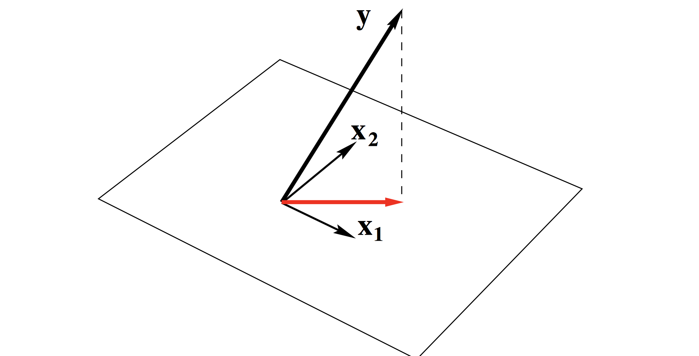
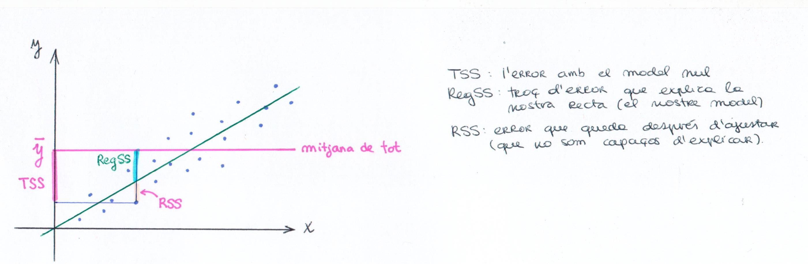
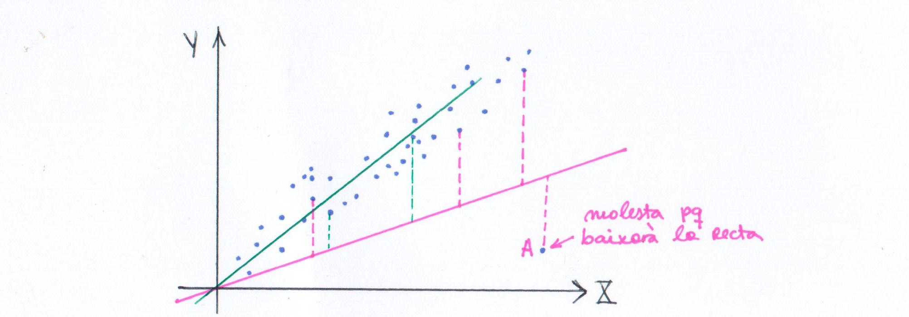
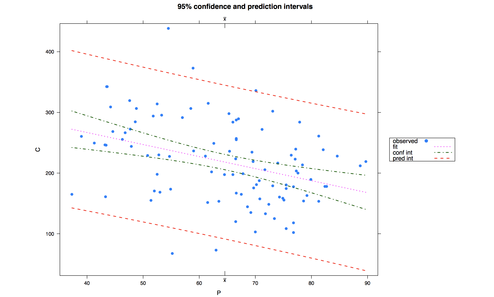
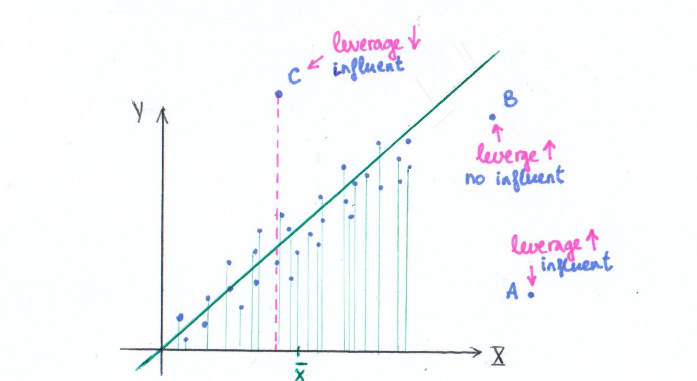
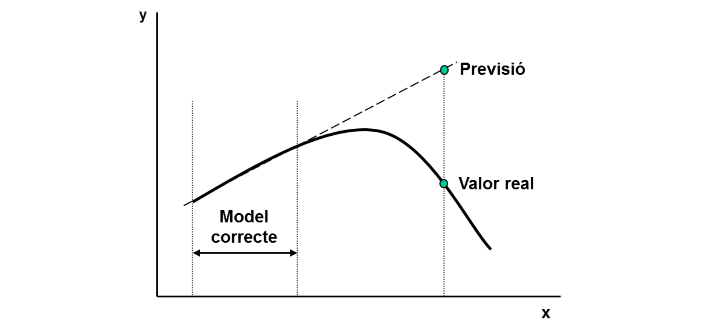

> **Parsimony principle**: Among competing models, all of which provide an adquate fit to a data set, the one with the fewest parameters is to be prefered. *(the Cambridge Dictionary of Statistics, B.S. Everitt)*
Thus, it will be very important to select appropriately the variables.

> **Interesting quote form G. Box:**" Essentially, all models are wrong, but some are useful".

## General objective
All these situations have in common that one is interested in describing the behaviour of a *random variable* $Y$ known as **dependent variable** as a funcion of some other variables known as: **independent**, **explanatory** or **covariates**, also **factors** if they are *cathegorical*.
The explanatory variables will represent, in most of the cases, the experimental conditions.

# Definition of linear model
Our aim is to explain the behaviour of a *random variable* $Y$ as a function of $X_1,X_2,...,X_{p-1}$, which are the *explanatory* variables, that can be random or deterministic and they are independent of errors.
The **experimental conditions** are tha values taken by the $X$'s for each *experimental unit*. And an **experimental unit** is the unit upon which the response variable $Y$ is measured. Examples of response variables are: individuals, yogurts, programs, and so on. A formal definition follows:

> Given $n \in Z^+$, $\forall i \in \{1,2,...,n\}$ let $Y_i$ be the variable related to $Y$ when $X_1 = x_{i1},X_2 = x_{i2},... ,X_{p-1} = x_{ip-1}$, where $x_{ik} \in \mathbb{R} ,\forall i,j$.

**Definition**:
$$
\forall i, Y_i = \beta_0 + x_{i1} \cdot \beta_1 + x_{i2} \cdot \beta_2 + ... + x_{i(p-1)} \cdot \beta_{p-1} + e_i = \mu_i + e_i
$$
**Hypothesis**:

+ *Normalitat*: $\forall i \in \{1,2,...,n\}, e_i \sim N(0, \sigma_i^2)$
+ $\forall i \in \{1,2,...,3\}, \sigma_i^2=\sigma^2$ (homocedasticity = igualtat de variàncies)
+ $\forall i, j \in \{1,2,...,n\}\quad i \neq j$, $e_i$ independent of $e_j$.

$\beta_0$ is known as **intercept**. 

La forma més bàsica que lliga una $X$ amb una $Y$ és mitjançant una recta: $Y=aX+b+e$. I si tenim moltes $X$'s? Aleshores, el més adequat és ajustar per un hiperplà, per això sorgeix la definició matricial del model lineal. La matriu $X$ s'anomena *matriu de disseny* (**design matrix**).
In matrix form:
$$
\begin{pmatrix}
Y_1 \\ Y_2 \\ \vdots \\ Y_n
\end{pmatrix}
=
\begin{pmatrix}
1 & x_{11} & x_{12} & x_{13} & ...& x_{1(p-1)} \\ 
1 & x_{21} & x_{22} & x_{23} & ...& x_{2(p-1)} \\ 
\vdots & \vdots & \vdots & \vdots & \ddots & \vdots \\
1 & x_{n1} & x_{n2} & x_{n3} & ...& x_{n(p-1)}
\end{pmatrix}
\begin{pmatrix}
\beta_0 \\ 
\beta_1 \\ 
\beta_2 \\
\vdots  \\
\beta_{p-1}
\end{pmatrix}
+
\begin{pmatrix}
e_1 \\ 
e_2 \\
\vdots  \\
e_n
\end{pmatrix}
$$
*The $i$-th row of the matrix $(1, x_{i1}, x_{i2}, ..., x_{i(p-1)})$ shows the experimental conditions of the response $y_i$. *

El vector resposta $Y$ es aleatori i com que $X\beta$ és determinista (també podria no ser-ho), el vector d'error també aleatori. Per què sorgeix el vector error? Perquè tot i que tinguem les $X$'s fixades, hi ha altres factor que afecten a la variable resposta que no tenim en compte. Per exemple, si estem estudiant la pèrdua de pes en certs individus, podem mirar les varaibles explicatives *dieta* i *tipus d'esport*, però segur que també hi ha altres causes de pèrdua o guany de pes, per exemple, l'*estrés*. I com més variables posem, més semblant serà a la realitat, però sempre ens deixarem algún detall que afectarà. I aquests detalls els empaquetem en el vector error.

Què passa si ens deixem una variable explicativa important? Doncs trobarem errors molt grans, hi haurà una discrepància considerable entre el que observem i el que modelem. És millor controlar més variables, perquè al final, si no necessitem alguna, sempre la podrem descartar.

> Defining $Y_{n \times 1}=(Y_1, Y_2, ..., Y_n)^t$, $X_{n \times p}=(x_{ij})$,
$\beta_{p \times 1} = (\beta_0, \beta_1, \beta_2, ..., \beta_{p-1})^t$, 
$e_{n \times 1}=(e_1, e_2, ..., e_n)^t$, the model is written as:
$$
Y = X\beta+e \iff \mu = E(Y|X)=X\beta
$$
$$
Y|X \sim N(X\beta, \sigma^2 \cdot Id_n)
$$
$$
\begin{pmatrix}
Y_1 \\ Y_2 \\ \vdots \\ Y_n
\end{pmatrix}
\sim
N(X\beta, \begin{pmatrix}
\sigma^2 & 0 & ... & 0 \\
0 & \sigma^2 & ... & 0 \\
\vdots & \vdots & \ddots & \vdots \\
0 & 0 & ... & \sigma^2
\end{pmatrix})
$$

Els valors tenen esperança zero (centrat en 0, en el component determinista) per no cometre errors i variància igual (components independents). La mateixa hipòtesi de *Normalitat* es pot aplicar sobre $e \sim N(0, \sigma^2 \cdot Id_n)$ - els errors se suposa que estan centrats en 0 i la variància ha de ser la mateixa per totes les condicions experimentals. L'esperança depèn de les condicions experimentals, però la variància no! 

Per què *Normalitat*? La principal raó és pel **Teorema Central del Límit**. En l'error posem totes les influències que hi ha (d'altres variables), que afecten una mica però com que són infinites (al cap i a la fi, tot afecta a tot), la suma de tots aquests petits errors que afecten una mica sumen a una distribució normal. 

$\mu$ és el vector de les esperances. El model lineal també el podriem definir sense l'error com $\mu = E(Y|X)=X\beta$, veiem que el valor esperat és lineal amb les variables explicatives: $X\beta$. El model lineal es generalitza amb aquesta última fórmula.

## Examples of linear models 

> The models used in the **analisis of variance** (**ANOVA**) are LM with cathegorical covariates.

En *ANOVA*, és una matriu plena de 0's i 1's, perquè les explicatives són categòriques (hi ha diverses categories: $categoria_1, categoria_2, ...$) i la matriu $X$ tindrà valors 0 o 1 per saber si l'observació pertany a $categoria_1$ o $categoria_2$ o qualsevol altra.

For categorical explanatory variables there are parameters for the differentlevels of a factor. The corresponding elements of $X$ are chosen to exclude or include the appropriate parameters for each observation; they are called *dummy variables*. If they are only zeros and ones, the term indictor variable is used.

**Example**: one wants to compare the blood pressure ($Y$) in two types of individuals, those that have taken a special medication and those that have not.
$$
Y_{ij} =  \mu_{ij} + e_{ij}, \quad \forall i \in \{1, 2\}, \quad j \in \{1,2,...,n_i\}
$$
in matrix form, 
$$
\begin{pmatrix}
Y_{11} \\ \vdots \\ Y_{1n_1} \\ \vdots \\ Y_{2n_2}
\end{pmatrix}
=
\begin{pmatrix}
1 & 0 \\ \vdots & \vdots \\ 1 & 0 \\ 0 & 1\\ \vdots & \vdots \\ 0 & 1
\end{pmatrix}
\begin{pmatrix}
\mu_1 \\ \mu_2
\end{pmatrix}
+
\begin{pmatrix}
e_{11} \\ 
\vdots \\
e_{1n_1} \\
\vdots  \\
e_{2n_2}
\end{pmatrix}
$$
**Example**: three groups and seven observations. The given data set has the first three observations belonging to the first group, the following two observations belonging to the second group and the final two observations belonging to the third group. If the model to be fit is just the mean of each group, then the model is
$$
y_{ij}=\mu_i+e_{ij}
$$
$$
\begin{pmatrix}
y_1 \\ y_2 \\ y_3 \\ y_4 \\ y_5 \\ y_6 \\ y_7
\end{pmatrix}
=
\begin{pmatrix}
1&0&0 \\ 1&0&0 \\ 1&0&0 \\ 0&1&0 \\ 0&1&0 \\ 0&0&1 \\ 0&0&1
\end{pmatrix}
\begin{pmatrix}
\mu_1 \\ \mu_2 \\ \mu_3
\end{pmatrix}
+
\begin{pmatrix}
e_1 \\ e_2 \\ e_3 \\ e_4 \\ e_5 \\ e_6 \\ e_7
\end{pmatrix}
$$

>The models known as **regresion models** are also a particular case of LM. In this case the covariates are continuous or discrete (*numeric*) not cathegorical.

For a continuous explanatory variable $X$ (such as gestational age in the example on birthweight) the model contains a term $\beta X$ where the parameter $\beta$ represents the change in the response corresponding to a change of one unit in $X$.

**Example**: One wants to study the level of a chemical agent in a plant ($Y$) as a function of the presence of this chemical in the soil ($X$).
$$
Y_i = \beta_0+x_i\beta_1+e_i, \quad i = 1,..., n
$$
in matrix form,
$$
\begin{pmatrix}
Y_{1}  \\ Y_{2} \\ \vdots \\ Y_{n}
\end{pmatrix}
=
\begin{pmatrix}
1 & x_1 \\ 
1 & x_2 \\ 
\vdots & \vdots \\ 0 & x_n
\end{pmatrix}
\begin{pmatrix}
\beta_0 \\ \beta_1
\end{pmatrix}
+
\begin{pmatrix}
e_{1} \\ 
e_{2} \\
\vdots  \\
e_{n}
\end{pmatrix}
$$
**Example**: multiple regression with two *covariates* (explanatory variables): $X_{i1}$ and $X_{i2}$. Again suppose that the data consist of seven observations, and that for each observed value to be predicted ($Y_i$), values $X_{i1}$ and $X_{i2}$ of the two covariates are also observed. The model to be considered is:
$$
y_i=\beta_0 + \beta_1 x_{i1} + \beta_2 x_{i2} + e_i, \quad i \in \{1,2,3,4,5,6,7\}
$$
$$
\begin{pmatrix}
y_1 \\ y_2 \\ y_3 \\ y_4 \\ y_5 \\ y_6 \\ y_7
\end{pmatrix}
=
\begin{pmatrix}
1&x_{11}&x_{12} \\ 1&x_{21}&x_{22} \\ 1&x_{31}&x_{32} \\ 1&x_{41}&x_{42} \\ 1&x_{51}&x_{52} \\ 1&x_{61}&x_{62} \\ 1&x_{71}&x_{72}
\end{pmatrix}
\begin{pmatrix}
\beta_0 \\ \beta_1 \\ \beta_2
\end{pmatrix}
+
\begin{pmatrix}
e_1 \\ e_2 \\ e_3 \\ e_4 \\ e_5 \\ e_6 \\ e_7
\end{pmatrix}
$$

>The models known as **Analysis of Covariance** (**ACOVA**) are linear models in which the regression coefficients change by changing the levels of a cathegorical variables. It blends *ANOVA* with *regression*.

En **ACOVA** estan presents els dos tipus de variables explicatives: les numèriques i les categòriques. *ACOVA* permet eliminar l'heterogeneïtat causada en la variable d'interès (variable dependent) per la influència d'una o més variables quantitatives (covariables). Bàsicament, el fonament del ANCOVA és un ANOVA a qui a la variable dependent se li ha eliminat l'efecte predit per una o més covariables per regressió lineal múltiple. La inclusió de covariables pot augmentar la potència estadística perquè sovint redueix la variabilitat.

**Example**: One wants to study the levels of a given drug ($Y$) as a function of the dose ($X_1$). Moreover one has also consider the gender, since it is thought that the effect may change depending on the gender ($X_2$). How do we model that?

+ If we only have the drug dose: $Y_i = \beta_0+Dose_i\beta_1+e_i$, it takes 2 parameters. If this LM *does* model the response, it means that the response does not depend upon the gender.
+ If everybody's response is the same $\pm e_i$, it takes one parameter: $Y_i = \beta_0+e_i$, this is one called *null model*, and it means that it does not depend on the gender nor on the dose.
+ *ACOVA approach* (3 parameters, one numeric and one cathegorical): $Y_i = \beta_0+Dose_i\beta_1+Gender_{F}\beta_2+e_i$. La $\beta$ dels homes ($Gender_M$) està fixat a 0 (fixada com a *baseline*) per poder comparar l'altra amb aquesta.

Si en $Y_i = \beta_0+Dose_i\beta_1+Gender_{F}\beta_2+e_i$, $\beta_2$ dóna positiu, aleshores vol dir que la droga en la dona és més gran - la dona absorbeix més perquè a la sang veiem més droga en les dones. Si $\beta_2$ dóna negatiu, significa que les dones absorbeixen menys i que els homes absorbeixen més.

Una altra forma de comparar seria fer dues rectes:

+ Dones: $y_i=(\beta_0+\beta_2)+\beta_1 Dose_i+e_i$
+ Homes: $y_i=\beta_0+\beta_1 Dose_i+e_i$

I el que fem és comparar $\beta_0+\beta_2$ i $\beta_0$, i $\beta_1$ és igual en les dues rectes.

Una altra opció seria canviar el pendent: 
$$
y_i=\beta_0+\beta_1 Dose_i+\beta_2 Gender_W+\beta_3 Dose \ast Gender_W + e_i
$$
A on $Dose \ast Gender_W$ és la **interacció**.

O estimar un pendent per les dones i un pendent pels homes (4 paràmetres). Multipliquem la dosi per 1 si és dona i per 0 si és homes:
+ Dones: $y_i=(\beta_0+\beta_2)+(\beta_1+\beta_3) Dose_i+e_i$
+ Homes: $y_i=\beta_0+\beta_1 Dose_i+e_i$

$$
Y_{ij}=\beta_{0i}+x_{ij}\beta_{1i}++e_{ij}, \quad i \in \{1,2\}, \quad j \in \{1,2,...,n_i\}
$$
The **null model** is the one with just one parameter (the simplest model):
$$
Y_i=\beta_{0}++e_{i}, \quad i \in \{1,2,...,n\}
$$

In matrix form:
$$
\begin{pmatrix}
Y_{1}  \\ Y_{2} \\ \vdots \\ Y_{n}
\end{pmatrix}
=
\begin{pmatrix}
1 \\ 
1 \\ 
\vdots\\ 1
\end{pmatrix}
\begin{pmatrix}
\beta_0 
\end{pmatrix}
+
\begin{pmatrix}
e_{1} \\ 
e_{2} \\
\vdots  \\
e_{n}
\end{pmatrix}
$$
It is equivalent to study one sample from a *random variable*. $\beta_0$ is denoted as *intercept* and we will usually consider models with intercept, in order that they contain the *Null model* as a submodel.
$$
X \sim Null(\mu, \sigma), \quad \hat{\mu}=\bar{x}, \quad \hat{\sigma}^2=\frac{1}{n-1}\sum_{i=1}^{n}(x_i-\bar{x})^2
$$

# Parameter estimation
## Parameter vector estimation: **Least Squares**
Let $y = (y_1,y_2,...,y_n)^t$ be a realization of $Y$ and $\hat{\beta}$ an  estimation of $\beta$.

1) **Minimum least squares** estimation minimizes:
$$
S(\beta)=||y-\hat{y}||_2^2=\sum_{i=1}^{n}(y_i-\hat{y_i})^2=\sum_{i=1}^{n}(y_i-\sum_{j=0}^{p-1}x_{ij}\beta_j)^2
$$
where $\hat{y}=\hat{\mu}=X\hat{\beta}$. We minimize the norm of the difference vector and if the matrix is invertible, we always find the solution $\hat{\beta}=(X^tX)^{-1}X^ty$, if $X^tX$ is not a singular matrix (= has inverse). 

Per a aquest estimador no cal que es compleixi la hipòtesi de normalitat, perquè únicament el que estem fent és minimitzar la diferència entre el valor observat i el valor predit. Per tant, si no tenim normalitat, aquesta estimació segueix sent mínim quadràtica. No podrem fer el test d'hipòtesi, si no hi ha normalitat, però l'estimació si que la podrem fer. Però si realment tenim normalitat del vector resposta, aleshores podem fer l'estimació del màxim versemblant.

2) **Weighted least squares** minimizes:
$$
S(\beta)=\sum_{i=1}^{n}w_i(y_i-\hat{y_i})^2=\sum_{i=1}^{n}w_i(y_i-\sum_{j=0}^{p-1}x_{ij}\beta_j)^2
$$
where $w_i^{-1}=Var(Y_i)$. 

Amb *mínims quadrats ponderats* quantifiquem els errors com las diferència entre l'**observació** i la **predicció**: $(y_i-\hat{y_i})$. Si la variància és petita, el resultat resulta ser més fiable, si la variància és més gran, menys fiable. Per tant, comptem aquestes diferències i les ponderem segons la variabilitat. Si varia més, té més pes. 

Solution: $\hat{\beta}=(X^tV^{-1}X)^{-1}X^tV^{-1}y$, if $X^tV^{-1}X$ is not a singluar matrix (= has inverse), being $V=diag(w_i)$.

*Observation*: no probability distribution for vector $Y$ is required.

## Parameter vector estimation: **Maximum Likelihood**
Estimates maximize:
$$
L(\beta;y)=(\sqrt{2\Pi}\sigma)^{-n}exp{(-\sum_{i=1}^n\frac{(y_i-\sum_{j=0}^{p-1}x_{ij}\beta_j)^2}{2\sigma^2})}
$$
which is equivalent to:
$$
l(\beta;y)=-nlog(\sqrt{2\Pi}\sigma)-\sum_{i=1}^n\frac{(y_i-\sum_{j=0}^{p-1}x_{ij}\beta_j)^2}{2\sigma^2}
$$
Let us define
$$
U_j=\frac{\partial l}{\partial \beta_j}=\frac{1}{\sigma^2}(X^t(Y-X\beta))_j \quad \forall j
$$
The vector $U=(U_1, U_2, ..., U_{p-1})^t$ is called the **score vector**.
$$
U_j=0 \quad \forall j \iff X^tY = X^tX\beta \iff \hat{\beta}=(X^tX)^{-1}X^tY
$$
if the rank of $(X^tX)$ is equal to $p$. $\hat{\beta}$ is U.M.V.U.E. (*Minimum-variance unbiased estimator*). 

Això vol dir que aquest estimador apunta cap al veritable vector teòric, és a dir, les nostres dades provenen d'un model que té un vector teòric que desconeixem, i el $\hat{\beta}$ té com a valor esperat el vector teòric i tots els estimadors que tenen com a valor esperat el vector teòric (= unbiased) són els que varien menys, i per això és el millor estimador.

# Predicted values and raw residuals
**Què són els *valors predits*?** Són els valors que presiu el nostre model, per tant, els valors predits venen definim com: un cop hem estimat el paràmetre, el vector de predicció del nostre model (vector resposta) és $\hat{Y}=X\hat{\beta}$.

The vector of predicted values is $\hat{Y}=X\hat{\beta}=\begin{pmatrix}\hat{Y_1}\\\hat{Y_2}\\\vdots\\\hat{Y_n}\end{pmatrix}$. If $\begin{pmatrix} y_1\\ y_2\\ \vdots \\y_n\end{pmatrix}$ is a realization of the $Y$ vector, the raw residual of the observation $y_i$ os equal to: **raw residual** $= y_i-\hat{y_i}=\hat{e_i}$.

El *raw residual* és la diferència entre el valor observat i el valor predit (és el que a R es diu *residual*).

## Geometrical interpretation of the Residual vector
$\hat{e}=Y-X\hat{\beta}$ is orthogonal to the columns of the matrix $X$.
$$
X^t\hat{e}=X^t(Y-X\hat{\beta})\\=X^t(Y-X(X^tX)^{-1}X^tY) \\ =X^tY-X^tX(X^tX)^{-1}X^tY\\=X^tY-X^tY=0
$$
Volem estimar $\beta$ de forma que la norma sigui mínima: $min\{||Y-\hat{Y}||\}$. El vector $\hat{Y}$ viu al subespai vectorial generat per les columnes de la matriu $X$, perquè $\hat{Y}$ és $\beta_0$ per la primera columna de $X$, més $\beta_1$ per la segona columna de $X$, etc. Si $\hat{Y}$ és generat per les columnes de $X$, quin és l'$\hat{Y}$ que minimitza la distància entre el vector $Y$ que viu no se sap a on? És la **projecció ortogonal**! Si tenim un vector en un subespai vectorial i un altre vector fora d'aquest subespai vectorial, el vector que minimitza la diferència entre el vector que hi és i el vector que està fora - és la *projecció ortogonal* ($\hat{Y}$ és el vector vermell).

Ara sabem dues coses més sobre el vector de **valors predits**, $\hat{Y}$:
+ Viu en el subespai generat per les columnes de la matriu del disseny $X$.
+ I és la projecció ortogonal de $Y$.
I és $\hat{e}=Y-X\hat{\beta}$ el vector d'error. El vector dels errors, per construcció, és ortogonal a cadascuna de les columnes de la matriu $X$.

# Variance estimation
## Residual variance estimation: Moment method
Sabem que el vector dels errors segueix una normal centrada en 0:
$$
e\sim N \left( \begin{pmatrix}
0  \\ 0 \\ \vdots \\ 0
\end{pmatrix}, \sigma^2 \begin{pmatrix}
1&0& \dots &0  \\ 0&1& \dots &0  \\ \vdots&\vdots& \ddots &\vdots  \\ 0&0& \dots &1 
\end{pmatrix}\right)
$$
Com estimem aquest segon paràmetre: la desviació estàndar ($\sigma$)/la variància ($\sigma^2$)? 

Hi ha dues maneres: una s'obté pel mètode del moments i l'altre s'obté per màxima versemblança.

**Moment method**. Cada de les observacions menys el seu valor predit és l'error: $\hat{e_i}=y_i-\hat{y_i}$. Quan tenim una mostra d'una normal, la $\mu$ l'estimem amb la mitjana aritmètica: $\hat{\mu} = \bar{\mu}$, i $S^2$ és l'estimació de la variància i és $S^2=\hat{\sigma}^2=\frac{1}{n-1} \sum_{i=1}^n(y_i-\bar{y_i})$ i per tant, $S=\sqrt{\frac{1}{n-1} \sum_{i=1}^n(y_i-\bar{y_i})}$.

Sabem també que si son dades d'una *Normal*, si li restem la $\mu$ i dividim per $\sigma$, serà una $N(0, 1)$ si estandaritzem i la suma de $n$ $N(0,1)$'s independents aixecades al quadrat segueix una $\chi^2$ de $n$ graus de llibertat:
$$
\sum_{i=1}^n\frac{(y_i-y)^2}{\sigma^2}=\frac{1}{\sigma^2}\sum_{i=1}^n(y_i-y)^2 \sim \chi_{n}^2
$$
Si en comptes de $\mu$, posem la seva mitjana $\bar{\mu}$ segueix una $\chi_{n-1}^2$ perquè perdem un grau de llibertat (model nul); (recordem que l'esperança d'una $\chi^2$ són els seus graus de llibertat) i per tant, $\mathbb{E}(\chi_{n-1}^2)=n-1$, d'on deduïm que: 
$$
\mathbb{E}(S^2)=\mathbb{E}\left(\frac{\sum_{i=1}^n(y_i-y)^2}{n-1} \right)=\sigma^2
$$

Ara, passem al cas on no estem en el *model nul*: quin és l'equivalent quan tenim explicatives?

Aquí els graus de llibertat canvien, perquè en el model nul hem estimat només un paràmetre (estimació de $\mu$). En un model amb explicatives estimem $p$ paràmetres i perdem un grau de llibertat per cada paràmatre que estimem, per tant, 
(assuming that $p = rank(X^tX)$, with maximum rank):
$$
S^2=\frac{1}{n-p}\sum_{i=1}^n(y_i-\hat{y_i})^2 \sim \chi_{n-p}^2
$$
Thus **$S^2$** is an **unbiased estimator** of $\sigma^2$ and it is also U.M.V.U.E. This estimator is known as the **mean square error** (= mitjana dels errors al quadrat). Aquest estimador, però, no és el màxim versemblant!

## Residual variance estimation: Maximum Likelihood
The log-likelihood function as a function of $\sigma$ is equal to:
$$
l(\sigma^2;\mu)=-nlog(\sqrt{2\Pi\sigma^2})-\sum_{i=1}^n\frac{(y_i-\mu_i)^2}{2\sigma^2}
$$
differentiating and equating to zero one has that:
$$
\frac{\partial l}{\partial \sigma^2}=\frac{-n}{\sigma^2}+\frac{1}{(\sigma^2)^2}\sum_{i=1}^n(y_i-\mu_i)^2=0\iff\hat{\sigma}^2=(1-\frac{p}{n})S^2
$$
*Observation*: if $n$ is large, both estimators are similar. For $p$ and $n$ relatively small they may differ quite a lot.

## Parameter interpretation
Analizem el cas de regressió lineal simple: sabem que si $\beta$ dóna diferent de 0, vol dir que la variable que va associada és important per a la resposta i si no, doncs no ho és. Però, si ens surt, per exemple, $\beta = 2.7$, *com ho interpretem?*

Agafem com a exemple el següent model, on tenim el pes en funció de l'alçada d'una persona: $Y=\beta_0 + \beta_1X+e$, on $Y$ és el pes (en Kg) i $X$ és l'alçada (en cm). Ara, imagineu-vos que tenim una altra persona que és 1 cm més alta:
$$
Y^*=\beta_0 + \beta_1(X+1)+e=\beta_0 + \beta_1X+\beta_1+e=Y+\beta_1+e
$$
Traiem els errors $e$ perquè estem fent prediccions: 
$$
Y^*=Y+\beta_1+e=\hat{Y}+\beta_1, \quad \beta_1=Y^*-\hat{Y}
$$
Si augmentem la $X$ per una unitat, $\beta_1$ és la diferència que obtindrem en la resposta, és a dir, és l'increment en la resposta en augmentar l'explicativa en una unitat. Si en tenim varies d'explicatives, per exemple, l'alçada, l'edat i  el nivell de colesterol L'interpretació de $\beta_1$ serà la següent: si agafem una altra persona amb la mateixa edat i el mateix nivell de colesterol però 1 cm més, la $\beta_1$ mostra la diferència, com canvia el pes per canviar només en una unitat l'alçada i la resta tot igual.

En general: given that we are assuming
$$
\forall i, \quad Y_i=\beta_0+x_{i1}\beta_1+x_{i2}\beta_2+...++x_{i(p-1)}\beta_{p-1}+e_i=\mu_i+e_i,
$$
being $Y_i$ the response under the conditions $X_i=(x_{i1},x_{i2},...,x_{ij},...,x_{i(p-1)})$ and by $Y_i^*$ the response under the conditions:
$X_i^*=(x_{i1},x_{i2},...,x_{ij}+1,...,x_{i(p-1)})$ one has that
$$
X_i^*-Y_i=\hat{\beta_j}
$$
Thus,

+ $\hat{\beta_j}$ is the mean change contained by increasing one unit the covariate $x_j$ while leaving the other covariates equal.
+ If $\hat{\beta_0}$ designs the intercept estimation, it is interpreted as the mean response at the origin (all covariates equal to zero).

Ara bé, com interpretem la $\hat{\sigma}$? Recordem els intervals de confiança: a continuació tenim l'interval de confiança per una $\mu$: $\bar{\mu} \pm t_{\frac{\alpha}{2}, n-1} \frac{\sigma}{\sqrt n}$. En el cas de l'interval de confiança per a errors, haurem de mirar una *T-student* amb $n-p$ graus de llibertat (per construcció, la mitjana aritmètica dels errors és 0):
$$
0 \pm t_{\frac{\alpha}{2}, n-p} \hat{\sigma}
$$
The residual standard deviation $\hat{\sigma}$ is the error associated to our predictions. Si la $n$ és prou gran, la T-Student s'aproxima per la Normal, i $z_{0.975} = 1.96$,  $Pr(X<1.96) \approx 0.975$, $Pr(-1.96<X<1.96) \approx 0.95$ ($z_{0.975}$ is called the *97.5 percentile point*); 95% of our predictions will have an error in
$$
(-t_{n-p, \space\alpha/2}\space \hat{\sigma},t_{n-p, \space\alpha/2}\space \hat{\sigma}) \simeq (-1.95 \space\hat{\sigma},1.95 \space\hat{\sigma})
$$
Els errors que cometem, estan en aquest interval i com més petita sigui $\hat{\sigma}$, més petit serà aquest interval i millor estarem predint.

# Inference on the model parameters

Ara que sabem el valor puntual de les $\hat{\beta}$'s, volem fer inferència sobre elles (això és, calcular intervals de confiança i fer tests d'hipòtesis). Per això, necessitem la ditribució de $\hat{\beta}$.

**$\hat{\beta}$ distribution**

Si $\beta^*$ és el valor veritable del paràmetre, el desconegut, el teòric:
$$
\hat{\beta}|X \sim N(\beta^*, \sigma^2(X^tX)^{-1})
$$
Perquè $\hat{\beta}$ és una combinació lineal de variables aleatòries Normals. La distribució de $\hat{\beta}$ està centrada en el valor teòric $\beta^*$.
$$
\mathbb{E}(\hat{\beta}|X)=\mathbb{E}((X^tX)^{-1}X^t|X)=(X^tX)^{-1}X^t\mathbb{E}(Y|X)=\\
=(X^tX)^{-1}X^t\beta^*=\beta^+
$$
I donat que $\hat{\beta}-\beta_0=(X^tX)^{-1}X^t(Y-\beta_0X)$, per trobar la matriu de variàncies i covariàncies, es busca l'esperança del vector aleatòri menys el seu esperat pel seu transposat:
$$
\mathbb{E}((\hat{\beta}|X-\beta^*)(\hat{\beta}|X-\beta^*)^t)=(X^tX)^{-1}X^t\mathbb{E}(Y-X\beta^*)(Y-X\beta^*)^t)X(X^tX)=
$$
$$
=\sigma^2(X^tX)^{-1}
$$
On $\sigma^2(X^tX)^{-1}$ és la matriu de variàncies i covariàncies de $\hat{\beta}$ i també, $\sigma^2(X^tX)^{-1}$ es coneix com la inversa de la matriu d'informació de Fisher (*Fisher information matrix*).

Hem vist que, l'estimació puntual del vector $\beta$ és:
$$
\hat{\beta}=(X^tX)^{-1}X^tY
$$
Com que $Y$ és aleatori, conseqüentment, $\hat{\beta}$ també és aleatori. Si repetim l'experiment sota les mateixes condicions experimentals, obtindrem resultats diferents. Això passa perquè les combinacions lineals de variables aleatòries Normals, també són Normals.

I l'estimació de la variància (de l'error):
$$
\hat{\sigma}^2=\frac{SSE}{n-p}=\frac{\sum_{i=1}^n(y_i-\hat{y_i})^2}{n-p} \sim \chi_{n-p}^2
$$
on $SSE$ és el *Standard Error Estimation*, $n$ és el nombre de dades que tenim i $p$ és el nombre de paràmetres del model, i $n-p$ són els seus graus de llibertat. Aquestes són les seves dues estimacions.

And, given that, $\hat{\beta}|X \sim N(\beta^*, \sigma^2(X^tX)^{-1})$, each componenent verifies $\hat{\beta_i}|X \sim N(\beta_i^*, \sigma^2[(X^tX)^{-1}]_{ii})$

La distribució de $\beta$ és important per fer tests d'hipòtesi. El test d'hipòtesi que més ens interessa és preguntar-nos si les $\beta$'s són 0 o no. Per exemple, en el cas de regressió lineal simple, $Y=\beta_0+X\beta_1+e$, quan fem el test d'hipòtesi:
$$
H_0:\quad \beta_1=0
$$$$
H_1:\quad \beta_1 \neq 0
$$
Aquí estem preguntem si realment la $X$ influencia la resposta o no. És el que ens fa el *summary* en R - fa el **T-Student** i determina si cada un dels $\beta$'s és estadísticament diferent de 0 o no. Aquest test es fa en base de la desviació estàndard de la $\beta$ que toca. 

Thus, for a given $a \in \mathbb{R}$, we can test:
$$
H_0:\quad \beta_i^*=a
$$$$
H_1:\quad \beta_i^* \neq a
$$
at level $\alpha$ by computing (estandarització):
$$
\frac{\hat{\beta_i}-a}{S \cdot \sqrt{[(X^tX)^{-1}]_{ii}}}
$$
and rejecting the null hypothesis ($H_0$) if
$$
\left| \frac{\hat{\beta_i}-a}{S \cdot \sqrt{[(X^tX)^{-1}]_{ii}}} \right| \geq t_{n-p, \frac{1-\alpha}{2}}
$$
Ja que la variància de $\hat{\beta_i}$ ve donada per $[(X^tX)^{-1}]_{ii}$, que és l'element $ii$ de la matriu de variàncies i covariàncies. 

**Confidence interval** for the parameters:
$$
\hat{\beta_i} \pm t_{n-p, \frac{\alpha}{2}}S \cdot \sqrt{[(X^tX)^{-1}]_{ii}}
$$
*Observation*: If the interval contains the zero value, the corresponding covariate is not statistically significative.

Si els intervals de confiança de dues $\hat{\beta_i}$'s diferents se solapen, direm que no són estadísticament diferents, significatives.

## Anova table and Omnibus test
L'**Omnibus test** és un test global del model. El que comporva és si, globalment, el nostre model explica una quantitat de variablitat important de la resposta o no. Concretament, el omnibus test es definit com:
$$
H_0: \beta_1=\beta_2=...=\beta_{p-1}=0
$$$$
H_1: \exists i | \beta_i \neq 0
$$
Si acceptem $H_0$ vol dir que hem posat explicatives que cap d'elles té sentit en el context de la resposta. Però si rebutgem $H_0$, vol dir que com a mínim hem posat una explicativa important (que explica una part important de la variablitat).

El test es basa en comparar variabilitats i les variabilitats són $S^2$'s, que són sumes de quadrats. Si la variabilitat de les nostres dades, capturada pel model, és molt més gran que la de l'error, direm que el nostre model explica ($H_1$); si la variabilitat de les dades és molt més petita que la de l'error, aleshores el nostre model no esplica ($H_0$). Tota la informació sobre la variabilitat la podem trobar a la **taula ANOVA**, on distingim 3 tipus de variabilitat:
$$
\begin{array}{c|c|c|c|c}
Source              & SS & d.f & MSS & F \\
\hline
Regression & \sum_{i=1}^n (\hat{Y_i}-\bar{Y})^2 & p-1 & \frac{RegSS}{p} & F_0=\frac{RegSS/p}{RSS/n-p}  \\
Residuals  & \sum_{i=1}^n (Y_i-\hat{Y_i})^2     & n-p & \frac{RegSS}{n-p} &   \\
Total      & \sum_{i=1}^n (Y_i-\bar{Y})^2       & n-1 &  &   \\
\end{array}
$$
En la **variabilitat total** (o *suma de quadrats total*, $TSS$ *Total Sum of Squares*) ens oblidem de les explicatives i de les diferents condicions experimentals - ens ho mirem tot com a única mostra, sense distingir grups. I és simplement sumatori de dada menys mitjana al quadrat passant per totes les dades:
$$
\sum_{i=1}^n (Y_i-\bar{Y})^2
$$
I la suma es gran perquè estem prenent dades de totes les condicions experimentals i per tant és una quantitat de variabilitat *gran*.

D'aquest paquet de variabilitat que tenim, hi ha una part que és deguda a les variables explicatives. Hi ha una part de variabilitat que és deguda a l'explicativa i una part deguda a l'error. Per tant, volem afinar: trencar aquesta variabilitat a la part que és deguda al model (explicada per les condicions experimentals) i a la part que no som capaços d'explicar (l'error):
$$
\sum_{i=1}^n (Y_i-\bar{Y})^2=\sum_{i=1}^n (\hat{Y_i}-\bar{Y})^2+\sum_{i=1}^n (Y_i-\hat{Y_i})^2 
$$
On $\sum_{i=1}^n (\hat{Y_i}-\bar{Y})^2$ és $RegSS$, *Regression Sum of Squares* i $\sum_{i=1}^n (Y_i-\hat{Y_i})^2$ és $RSS$, *Residual Sum of Squares*. I el model és bo quan $RegSS$ és gran i $RSS$ petit.

*Observació 1*: $\hat{\sigma}^2=S^2=\frac{RSS}{n-p}$.

Les *Sumes de Quadrats* de coses que provenen d'una Normal segueixen $\chi^2$ i el quocient de $\chi^2$'s independents segueix una Fisher ($F$). Així, el **test Omnibus** es fa - dividint la suma de quadrats del model de Regressió partit per $p$ entre suma de quadrats residual partit pels seus graus de llibertat $n-p$. Si la $H_0$ és certa, aquest quocient ha de venir d'una Fisher. Calculem $F_0$ i si és més gran que el punt crític de la Fisher, rebutgem $H_0$:

**$H_0$ es rebutjat quan $F_0 \geq F_{1-\alpha, p, n-p}$**.

O, com alternativa, calculem el p-valor, i si és més petit que 0.05, rebutgem $H_0$.

*Observació 2*: el test Omnibus compara el nostre model amb el model nul.

$R^2$ és la quantitat de variabilitat que explica el nostre model (quocient de RegSS i TSS). Proporció de variabilitat en les dades que ve explicada pel nostre model. I la resta és que no explica, per tant és de l'error.

Per estimar $SSE$ (*Standard Error Estimation*) és: $SSE = \frac{RSS}{d.f.}=\frac{RSS}{n-p}=\frac{\sum_{i=1}^n(y_i-\hat{y_i})^2}{n-p}$.

#Inference on the predicted values
##Predicted values distribution
A part d'inferència en els valors estimats, ens interessa fer també inferència sobre els valors predits ($\hat{Y_i}$), per això necessitem saber quina és la distribució de $\hat{Y_i}$'s. 

**Com trobavem els $\hat{Y_i}$?** $\hat{Y}=X\hat{\beta}$. Com que $\hat{\beta}$ és una Normal, el vector associat als valors predits és Normal també:
$$
\hat{Y}|X \sim N(X\beta^*, \sigma^2X(X^tX)^{-1}X^t)
$$
Prenem l'esperança de $\hat{Y}|X$ (la seva distribució està centrada en...):
$$
\mathbb{E}(\hat{Y}|X)=\mathbb{E}(X\hat{\beta}|X)=X\mathbb{E}(\hat{\beta}|X)=X\beta^*
$$
I la matriu de variàncies i covariàncies:
$$
\mathbb{E}((\hat{Y}|X-X\beta^*)(\hat{Y}|X-X\beta^*)^t)=X\mathbb{E}((\hat{\beta}|X-\beta^*)(\hat{\beta}|X-\beta^*)^t)X^t=
$$
$$
=X\sigma^2(X^tX)^{-1}X^t
$$
$$
=\sigma^2X(X^tX)^{-1}X^t
$$
I la matriu $X(X^tX)^{-1}X^t$ s'anomena **hat matrix**. S'anomena així perquè és el matriu per la qual hem de multiplicar la $Y$ per posar-li un barret: $\hat{Y}$:
$$
\hat{Y}=X(X^tX)^{-1}X^tY
$$
Per això $\sigma^2$ per la *hat matrix* dóna la matriu de variàncies i covariàncies de les prediccions.
$$
\hat{\beta}|X \sim N(\beta^*, \sigma^2(X^tX)^{-1})
$$
$$
\hat{Y}|X \sim N(X\beta^*, \sigma^2Hat)
$$
$$
Y \sim N(\mu, \sigma^2\cdot Id)
$$
*Observació*: la matriu de variàncies i covariàncies és diagonal si hi ha independència. En el cas de les $\hat{Y}$'s no assumim independència (de fet no ho són, surten totes de la mateixa fòrmula), per això la *Hat matrix* no és diagonal!

#More about residuals
##Residual vector distribution
Recordem que 
$$
e\sim N \left( \begin{pmatrix}
0  \\ 0 \\ \vdots \\ 0
\end{pmatrix}, \sigma^2(Id-X(X^tX)^{-1}X^t)\right)
$$
El residual i-èssim ve definit com: $\hat{e}=y_i-\hat{y_i}$. El vector $\hat{e}=(Y_1-\hat{Y_1}, Y_2-\hat{Y_2}, ..., Y_n-\hat{Y_n})^t$ es coneix com **vector residual i verifica**:
$$
\hat{e}|X\sim N \left( \begin{pmatrix}
0  \\ 0 \\ \vdots \\ 0
\end{pmatrix}, \sigma^2(Id-X(X^tX)^{-1}X^t)\right)
$$
És Normal perquè és un combinació lineal de variables aleatòries Normals. Està centrat a zero perquè:
$$
\mathbb{E}(\hat{e})=X\beta^*-X\beta^*=0
$$
I la seva matriu de variàncies i covariàncies, com que $\hat{e}=Y-\hat{Y}$, és:
$$
\mathbb{E}((Y-\hat{Y})(Y-\hat{Y})^t))=\sigma^2\cdot Id - \sigma^2X(X^tX)^{-1}X^t= \sigma^2(Id-Hat) 
$$ 

##Standarized and Studentized residuals
Necessitem estandaritzar els residus per veure si són grans o no, perque no en tenim prou en veure només el *raw residual*. Quan estandaritzem, tindrem una $N(0,1)$ i per tant, el 95% del residus caurà a l'interval (-1.96, 1.96) i els residus que es passin d'aquest intervals - podrem dir que són grans. 

**Com estandaritzem un residu?** Restem la seva esperança (que és 0) i dividim per la seva variància. Quina és la seva variània? Anem a la matriu de variàncies i covariàncies: hem d'agafar l'element $ii$ de la diagonal. Així, l'estimació de la variància del residu $\hat{e}=y_i-\hat{y_i}$ és:
$$
S^2 \cdot (1-[X(X^tX)^{-1}X^t]_{ii})
$$
I el **residu estandaritzat** és:
$$
Stand.Res=\frac{\hat{e}}{S\sqrt {1 -[X(X^tX)^{-1}X^t]_{ii}} }=\frac{y_i-\hat{y_i}}{S\sqrt {1 -[Hat]_{ii}} }
$$
La *QQ plot* dibuixa els residus estandaritzats i si estan a la recta - són Normals.

El **residu de Student** ve definit com:
$$
Student.Res=\frac{\hat{e}}{S_{(-i)}\sqrt {1 -[X(X^tX)^{-1}X^t]_{ii}} }=\frac{y_i-\hat{y_i}}{S_{(-i)}\sqrt {1 -[Hat]_{ii}} }
$$
on $S_{(-i)}$ és l'estimació de la variància quan ajustem el model **sense** l'observació i-èssima. Són més laboriosos de calcular perquè hem d'ajustar el model per cada observació que tenim. 

**Quina utilitat tenen els residus de Student?** Els residus de Student ens ajuden a identificar les observacions que són influents i per observació influent entenem que si hi és o no hi és - el model canvia molt. Vegem en un exemple simple (el cas es pot extrapolar a regressions lineals amb moltes explicatives, aleshores no ho podrem imaginar i els residus de Student ens ajudaran):

En aquest exemple veiem que per incloure al model el punt $A$, la recta de regressió baixa considerablement. Si suprimim el punt $A$ i calculem els residus, seran tots molt més petits perquè ajustem millor sense $A$! Per tant, les observacions que tenen un resisu de Student molt gran, són residus als que hem de posar més atenció, perquè poden ser observacions influents.

#Predicted Intervals for predictions (PI)
La gràcia de modelar és que podem predir fins i tot sobre condicions experimentals que no han estat contemplades a l'experiment que hem realitzat per a obtenir les dades. Però... les nostres prediccions estaran igual d'acurades a tot arreu? Com més lluny estiguin les noves condicions experimentals de les condicions experimentals originals per obtindre les observacions, més error de predicció tindrem. Com més lluny estigui del centre de gravetat, pitjor serà la predicció.

Sigui $X^*=(x_1^*,x_2^*,...,x_{p-1}^*)^t$ unes noves condicions experimentals. El valor predit amb $X^*$ és $\hat{y}^*=(X^*)^t \hat{\beta}$ (= la predicció en les noves condicions experimentals).

Aquesta predicció que acabem de fer, és una predicció puntual - és una estimació puntual que obtindrem en les noves condicions experimentals. Però també podem fer intervals de confiança per a aquesta predicció.

**Quin és el interval que sota aquesta condició el 95% de vegades contindrà el valor predit?** L'interval de confiança perl valor predit és el **interval de predicció** (*PI*).

Recordem que sota normalitat i el model nul, el interval de confiann per la $\mu$ es calcula com $\bar{\mu}\pm t_{1-\frac{\alpha}{2}, n-p}\frac{S}{\sqrt n}$. En aquest cas, un interval de predicció al $100(1-\alpha)$% de confiança per a aquesta futura observació és:
$$
\hat{y}^* \pm t_{1-\frac{\alpha}{2}, n-p} \sqrt{\hat{\sigma}^2(1+(X^*)^t(X^tX)^{-1}X^*)}
$$
$$
\hat{y}^* \pm t_{1-\frac{\alpha}{2}, n-p} \sqrt{\hat{\sigma}^2(1+Hat)}
$$
És l'interval que conté el valor predit amb un 95% de probabilitat.

Pel cas particuar d'una regressió lineal simple, el PI és:
$$
\hat{y}^* \pm t_{1-\frac{\alpha}{2}, n-p} \sqrt{\hat{\sigma}^2\left(1+\frac{1}{n}+\frac{(X^*-\bar{x})^2}{\sum_{i=1}^n(x_i-\bar{x})^2}\right)}
$$
**Com volem els intervals de confiança, grans o petits?** Com més estret sigui millor, les prediccions són més acurades. Per tant - petits. En la regressió lineal simple: si el nou valor que volem predir, està a la vora de $\bar{x}$, que és la mitjana de totes les $x_i$'s, com el nou valor $x^*$ no dista molt de $\bar{x}$, la variància és petita i l'interval de confiança serà més estret. Però si $x^*$ està molt lluny del centre de gravetat, de les condicions experimentals sota les quals hem pres les mesures, aleshores l'interval de confiança serà molt ample. Tot això, també és cert en regressió lineal múltiple.

**Què podem fer perquè els intervals de confiança surtin petits?** Una manera seria augmentar el valor de $n$; això és lògic, ja que si $n$ és petit tot serà molt incert, tindrem molta variància i els intervals de confiança seran grans. Ara imaginem, que per qüestions d'economia i temps només podem agafar un cert nombre $n$ de punts i no més, amb el mateix nombre de paràmetres ($n$ fix, $p$ fix) i el nivell de significació també fix ($\alpha$ fixa): com podem fer la recollida de dades pe tal que l'interval sigui petit? Hem d'agafar els $n$ punts que disten més de l'un a l'altre, per tal que la variància sigui gran (= quocient petit = interval petit), o sigui, condicions experimentals molt diferents (intentar omplir tot el rang dels possibles valors). Així tindrem més precisió amb l'interval de confiança.

#Confidence Intervals for mean responses (CI)
Els *confidence intervals* no són pels valor predits, sinó que pels valors esperats. La diferència entre valor predit i valor esperat és la mateixa que entre *variable aleatòria* $Y$ i *la seva esperança* $\mathbb{E}(Y)$. Òbviament, $\bar{y}$ varia menys que la pròpia $y$ variable. Llavors, la variància de les mitjanes aritmètiques és menor que la variància de la variable i això que fa que l'interval pels valors esperats (PI) sigui més ample que CI.

El valor ajustat a $X^*$ és $\hat{y}^*=(X^*)^t\hat{\beta}$. Sigui $\mu^*=\mathbb{E}(Y|X^*)$ i es té que $\mathbb{E}(\hat{y}^*)=(X^*)^t\hat{\beta}=\mathbb{E}(Y|X^*)$.

En conseqüència, $\hat{y}^*$ és un estimador no esbiaixat de $\mathbb{E}(Y|X^*)$. A més, 
$$
Var(\hat{y}^*)=\sigma^2Hat=\sigma^2(X^*)^t(X^tX)^{-1}X^*)
$$
I per això, un CI per a és:
$$
\hat{y}^* \pm t_{1-\frac{\alpha}{2}, n-p} \sqrt{\hat{\sigma}^2(X^*)^t(X^tX)^{-1}X^*}
$$
$$
\hat{y}^* \pm t_{1-\frac{\alpha}{2}, n-p} \sqrt{\hat{\sigma}^2Hat}
$$
En el cas particular d'una regressió lineal simple, el CI és:
$$
\hat{y}^* \pm t_{1-\frac{\alpha}{2}, n-p} \sqrt{\hat{\sigma}^2\left(\frac{1}{n}+\frac{(X^*-\bar{x})^2}{\sum_{i=1}^n(x_i-\bar{x})^2}\right)}
$$

#Important to take into account
##Determination coefficient
El **coeficient de determinació** ($R^2$) és la quantitat de variabilitat de la variable resposta explicada pel nostre model. Dit d'una altra manera, proporció de la variabilitat en la resposta explicada pel model. Es troba com:
$$
R^2=\frac{RegSS}{TSS}\cdot100\%
$$
Com més proper a 1, millor és el model, si és compleixen les assumpcions (assumptions) del model es compleixen. És una *goodness of fit measure*, que vol dir que és una mesura que serveix per dir si el nostre model és bo o no.

##Multicollinearity
$$
X=
\begin{pmatrix}
1 & x_{11} & x_{12} & x_{13} & ...& x_{1(p-1)} \\ 
1 & x_{21} & x_{22} & x_{23} & ...& x_{2(p-1)} \\
\vdots & \vdots & \vdots & \vdots & \vdots & \vdots \\
1 & x_{i1} & x_{i2} & x_{i3} & \dots & x_{i(p-1)} \\
\vdots & \vdots & \vdots & \vdots & \vdots & \vdots \\
1 & x_{n1} & x_{n2} & x_{n3} & ...& x_{n(p-1)}
\end{pmatrix}
$$
Recordem que $\hat{\beta}=(X^tX)^{-1}X^tY$. 

**Quan tindrem problemes num]erics per trobar l'estimació de $\beta$?** Quan tinguem $X_i$'s linealment dependents (= el determinant $X^tX$ és zero), no podrem trobar la inversa. En estadística, pot passar que una columna sigui *aproximadamaent* una combinació lineal de les altres, en aquest cas el determinant no serà 0, però serà molt petit. Recordem la fòrmula per trobar la inversa d'una matriu: si el determinant és petit, com que està al denominador, la inversa serà gran i, conseqüentment, les variàncies dels $\hat{\beta}$'s seran molt gran. I sí que tindrem una solució... Però amb una variabilitat brutal. I això no ens servirà de molt, perquè tindrem intervals de confiança molt grans i no podrem donar com a bones les nostres prediccions puntuals.

És a dir, si les variàncies de $\hat{\beta}$'s i els seus intervals de confiança surten molt grans, significa que tenim un problema de multicolinearitat. En el cas que no puguem trobar un $\hat{\beta}$, segur que tenim aquest problema (= vol dir que una columna és exactament una combinació lineal d'una altra). La multicolinearitat passa quan estem considernat un model que és més díficil del que hauria de ser, perquè si tenim una columna que és combinació lineal de les altres, primer de tot, estem considerant més variables que les necessaries (**overfitting**) i, segon, aquesta la podriem deduir igualment a partir de les altres. Hauriem de suprimir-la, perquè amb les altres ja en tindriem prou.

*Definition*: **multicollinearity** is a term used in regression analysis to indicate situations where the explanatory variables are related by a linear function. *(the Cambridge Dictionary of Statistics, B.S. Everitt)*

When two or more predictor variables are linearly dependent, they are called **collinear**. Multicollinearity implies that $det(X^tX)$ is very small or zero in the extreme case. És un problema exclusivament de la matriu del disseny $X$.

If collinearity exists:
+ The model interpretation is very difficult.
+ The variance of the $\hat{\beta_i}$'s parameters is large.
+ The matrix $X^tX$ may be singular which makes it impossible to compute the parameter estimations.

*Observation*: however, even if there is multicollinearity, the predictions are correct *if* the model is correct.

**Com podem detectar que hi ha multicolinearitat?** 

(1) Fer múltiples *Scatter plots* de parelles de variables explicatives (de dos en dos) i calcular el coeficient de correlació lineal:
$$
r_{x_1x_2}= \frac{\sum_ix_{1i}x_{2i}-n\bar{x_1}\bar{x_2}}{\left[\sum_ix_{1i}^2-n\bar{x_1}^2\right]^{1/2}\left[\sum_ix_{2i}^2-n\bar{x_2}^2\right]^{1/2}}
$$
Si el terme de correlació és relativament gran, una de les $X$'s ha de ser eliminada i s'ha refer l'anàlisi. Amb aquest mètode només enganxem les correlacions de parelletes, i si una columna és combinació lineal de 3 vegades una columna $l$ menys 5 vegades una columna $k$, no detectarem aquesta correlació. **Quina alternativa tenim?**

(2) Quan estem buscant correlacions entre variables explicatives, com que estem en el model lineal, simplement estem buscant si hi ha alguna columna que s'escrigui com a model lineal en el que intervenen les altres com a explicatives:
$$
X_3 \approx 3X_1-5X_2 \to X_3 = 3X_1-5X_2+e
$$
I si realment hi ha correlació, vol dir que aquest nou model lineal ajusta molt bé. Calcularem la $R^2$ d'aquest model (la columna en funció de les altres explicatives), $R^2(X_j)$. En el cas de l'exemple, seria $R^2(X_3)$. Si el coeficient de determinació és gran, voldrà dir que efectivament, aquesta columna és combinació lineal de les altres.

I ara calculariem el **Variance Inflation Factor** (*VIF*) de cada variable (= factor que infla la variància). El VIF ve definit com:
$$
VIF(X_j)= \frac{1}{1-R^2(X_j)}
$$
$$
\begin{array}{c|c}
VIF             & Conclusion \\
\hline
VIF = 1  & not \space\space correlated \\
1<VIF<5  & moderately \space\space correlated      \\
VIF >5   & highly \space\space correlated        \\
\end{array}
$$
*Observació*: $1-R^2(X_j)$ es coneix com a tolerància.

It may be proved that:
$$
Var(\hat{\beta_j})=VIF(X_j)\frac{\sigma^2}{\sum_i^n(x_{ij}-\bar{x_j})^2}
$$
thus as larger is the $VIF$ more variance will have the estimated coefficient, and consequently we can rely less on it.

**Què fem quan trobem $VIF > 5$?** Si una o més variables tenen un $VIF$ elevat, aleshores no les traiem totes de cop, sinó que traiem la que té el $VIF$ mé elevat i ajustem el model de nou (amb una variable menys). Si encara hi ha variables amb $VIF$ elevat, repetim el procediment. No podem treure-les totes de cop, perquè podriem perdre informació: si dues columnes estan correlacionades, les dies tindran el $VIF$ elevat, però en treure una d'elles, ek VIF de l'altra cau seguidament.

> Model fitting is an iterative process.

##Leverage
Cada $y_i$ té les seves condicions experimentals. Si fem la mitjana aritmètica de totes les condicions experimentals, trobariem el centre de gravetat del nostre núvol de punts: $(1, \bar{x}_1, \bar{x}_2, \bar{x}_3, ..., \bar{x}_{p-1})$ que és el vector de les condicions experimentals mitjanes (*centroid*).

Una observació té **leverage** quan les seves condicions experimentals disten molt de les condicions experimentals mitjanes que hem considerat a l'experiment. Una obseravació que té *leverage* elevat té moltes possibilitats de ser un punt influent, però no simplement per aquest fet - no ho podem assegurar. Necessitem una condició més.

**Com es calcula el leverage?** El *leverage* és exactament l'element i-èssim de la *Hat matrix*:
$$
h_{ii} = [X(X^tX)^{-1}X^t]_{ii}
$$
El *leverage* verifica que per qualsevol $i$, es compleix $\frac{1}{n} \leq h_{ii} \leq 1$. 

Observacions, les quals tenen $h_{ii}>\frac{3p}{n}$ o $h_{ii}>0.99$ són les que tenen el *leverage* elevat i s'han d'estudiar més detalladament.

##Influential obseravtions: Cook's distance
Cada observació té associada una distància de Cook, que es calcula a partir del *leverage* i del *raw residual*.

*Definition*: an influential observation is an observation that has a disproportionate influence on the values of the regression coefficients (*the Cambridge Dictionary of Statistics, B. S. Everitt*).

La distància de Cook es calcula com:
$$
D_i=\frac{h_{ii}}{1-h_{ii}}\cdot \frac{\hat{e_i}^2/S^2}{p+1}, \quad i=1\space...\space n
$$
I és gran si l'observació té *leverage* gran o té un residu estandaritzar gran.

*Observació 1*: els **outliers** són observacions influents.

*Observació 2*: si una obseravació té leverage gran i residu gran, això implica una distància de Cook gran i és una observació influent. Però si només és el leverage gran o el residu gran, pot ser una observació influent o no. I és feina nostra decidir si deixem l'observació o no.

##Influential  observations: DFFITS

Another measure that is quite similar to the Cook's distance is:
$$
DFTITS_{i}=\sqrt{\frac{h_{ii}}{1-h_{ii}}} \cdot StudentRes_i \quad i = 1, ..., n
$$

It is verified that:
$$
D_i \simeq \frac{(DFFITS_i)^2}{(p+1)}
$$

##Influential  observations: DFBETA, DFBETAS

To know if an observation is influent, there is sense to compute its impact on each one of the model's parameters.

Given the i-th observation, $i=1,...,n$ for $j=0,..., p-1$, 
$$
D_{ij} = \beta_j - \beta_{j(-i)} (DFBETA) \quad and/or \quad D^*_{ij}=\frac{\beta_j-\beta_{j(-i)}}{S_{(-i)}\beta_j}(DFBETAS)
$$

This will give a total number of $n\times p$ values that are usually better examined graphically.
If for a given $i$ one or several *DFBETA* or *DFBETAS* are large, we have to look carefully to that/those observation(s).

#Model Adequacy Checking
##Goodness of fit measures: $R^2$

More about the **Coefficient of determination**. It is defined as:
$$
R^2 = \frac{RegSS}{TSS} \cdot 100 \%
$$

Que és la suma de quadrats explicada pel model ($RegSS$), dividida per la suma de quadrats total ($TSS$). S'interpreta com el percentatge de la quantitat de variabilitat en la variable resposta explicada pel nostre model. Com més proper sigui a 100% (= el quocient a 1) - millor explica el model.

**Què amb $R^2$ passa si posem explicatives que no tenen res a veure, sense sentit?** Fins i tot, quan posem variables que no tenen res a veure amb el model, *el $R^2$ augmenta* perquè com que posem més paràmetres - expliquem més, encara que aquestes explicatives no tinguin sentit.

**El $R^2$ augmenta sempre quan posem més variables explicatives.** Podem arribar a tenir una bona bondat d'ajust però paguem un *cost*: com més paràmetres, més complex és el model i més díficil és per interpretar-lo. Per tant, hem de trobar un *trade-off* entre la quantitat de paràmetres i la bondat d'ajust. Això no ens ho dóna $R^2$, per si que ho fa la tant **$R^2$ ajustada**, per tant, sempre convé mirar la $R^2$ ajustada:

##Goodness of fit measures: adjusted $R^2$

Òbviament, com més covariables apareguin en el model, més gran serà el valor de $R^2$. Per tal de peanlitzar els models amb més covariables i poder comparar models amb diferents núm. de covariables, es calcula la $R^2$ ajustada.

Abans però, vegem aquesta simple relació (expressió alternativa de $R^2$):
$$
R^2 = \frac{RegSS}{TSS}=1- \frac{RSS}{TSS} 
$$

La proporció explicada pel model és el mateix que 1 menys la proporció no explicada (l'error, l'atzar $RSS$). Així, podem definir la $R^2$ ajustada com:

$$
R^2_{adj} =1- \frac{RSS/(n-p)}{TSS/(n-1)}=1-(1-R^2)\cdot\frac{n-1}{n-p}
$$

$R^2$ *ajustat* es calcula igual que $R^2$ però dividint entre els graus de llibertat de l'error ($n$ és el nombre d'observacions, $p$ - el nombre de paràmetres). 

Si comparem dos models, $R^2$ serà més gran del model que tingui més paràmetres. Però això no és el cas pel $R^2$ ajustat, perquè l'ajustat ens penalitza si fem servir molts paràmetres. Si $p$ és molt gran, el numerador de la fracció esdevé gran i per tant la resta serà petita, fent que $R^2_{adj}$ respecte $R^2$.

##Goodness of fit measures: details

També és el mateix dir que:
$$
R^2 = c^tR_{xx}c
$$

on $c=(r_{x_1y},r_{x_2y},...,r_{x_py})$ i $R_{xx}=(r_{x_ix_j})_{i,j}$ sent $r_{a,b}$ la correlació lineal de vectors $a$ i $b$.

La interpretació del $R^2$ és igual al producte d'una matriu per un vector fila i un vector columna. El vector $c$ és el que té totes les correlacions de la $Y$ amb la $X$. O sigui, si tenim un vector resposta $Y$ i unes explicatives $X$:

+ **Què volem, que la $Y$ sigui molt correlacionada amb les $X$'s o poc?** Com més correlacionada estigui la resposta amb les explicatives, més relació de dependencia lineal tenen. Per tant, voldrem un vector $c$ que tingui tots els valors propers a 1, perquè això ens estarà dient que la $Y$ està molt correlacionada amb les explicatives. Per tant, aquest vector mesura *la quantitat de relació lineal entre la resposta i les explicatives*.

La matriu $R_{xx}$ és la matriu de correlacions entre les columnes de la matriu $X$: 

+ **Com voldriem que fos aquesta matriu $R_{xx}$ idealment? Volem que les columnes de $X$ estiguin correlacionades molt o poc?** Gens! Per tant, idealment, voldriem que fos la identitat (= correlació 1 amb sí mateixa i amb les altres zero). No ho és, però; però a la diagonal si que té 1's i al voltant volem valors petits, perquè així té més sentit el nostre model: el que explica una variable, no ho explica una altra variable. Si no, tenim problema de *multicollinearity*.

Notes:

(1) $R^2 \in (0,1)$
(2) As larger it is, better is the fit.
(3) It is a measure of the correlation between the observed values and the one predicted by the model.

Matemàticament, estem calculant la norma del vector $c$, prenent com a matriu del producte escalar la matriu de correlacions de les columnes. Si estem en el cas ideal, amb $R_{xx}$ la identitat, estem fent el producte escalar euclideà, i la norma és la suma de les components al quadrat. Si les explicatives no estan gens correlacionades, ens trobem a l'esapi euclideà, amb els eixos euclideans. Si estan correlacionades, en certa manera, no estem formant 90 graus, si no que estem aixafant els eixos. En resum, estem treballant en un espai vectorial, on el producte escalar ve donat per la matriu de correlació:

(4) If $X$ columns have zero correlation, then $R_{xx}=Id_p$ and thus
$$
R^2 = c^t \cdot c = ||c||^2
$$

(5) For simple linear regression, $R^2 = (r_{xy})^2$
En el cas de regressió lineal simple, només tenim una explicativa: aquesta matriu ens retornarà un 1 (correlacionada amb si matiexa).Per tant en quedarà, la correlació de $Y$ amb l'explicativa al quadrat (un número). En regressió lineal simple, $R^2$ és exactament el coeficient de $Y$ amb la $X$ al quadrat.

Resumint, si volem comparar dos models, ens fixem en el $R^2$ ajustat i ens quedem amb aquell qe tingui el $R^2$ ajustat més gran i no necessariàment és aquell que té més paràmetres.

##Goodness of fit measures: Residual analysis
Sempre fem el *scatterplot* de la resposta en funció de les explicatives! Sobretot si només hi ha una explicativa, per veure si hi ha relació lineal. Perquè si veiem que hi ha una relació quadràtica, exponencial o alguna cosa semblant, ja no hi ha sentit fer el model lineal.

Quan hagim ajustat el model, normalment fem el plot del model, que ens dóna 4 gràfiques. El més important és els *residus versus els fitted* (el primer del plot del residus). 

**Què passa si veiem algún patró en els residuals vs fitted**? Si veiem algún patró, ens està dient que hi ha alguna cosa que no estem capturant amb el model. És a dir, hi ha alguna cosa que no som capaços d'explicar, perquè els residus han de sortir completamnet aleatoris. Si el model realment conté tot allò que és important, la resta són només petites perturbacions aleatòries i sense cap patró. Si hi ha algún patró és que hi ha alguna cosa que *podem* explicar però no ho estem fent. Per tant, sovint, si veiem patrons és que ens estem oblidant d'alguna variable important que no estem considerant en el model.

**Per veure la normalitat, com ha de ser el QQ plot?** El QQ plot ha de ser lineal i ens permet veure la normalitat. Estem comparant els quartils dels nostres residus amb els quartils de la $N(0,1)$. I ho deformem perquè quedi en una recta (= visualment és més fàcil d'entendre). Si els quartils dels nostres residus s'assemblen als quartils de la $N(0, 1)$, aleshores té sentit dir que els nostres residus provenen d'una $N(0,1)$.

**Per a què serveix el plot dels residus respecte l'ordre?** A vegades fem els residus vs l'ordre en els que fem. Això no sempre té sentit fer-ho, però quan són mesures d'un aparell (per exemple, una balança), sempre es fa els *residual vs order*, perquè és important per comprovar si l'aparell de mesura que estem fent servir es desequilibra a mesura que anem pesant (= si va perdent precisió). Si, per exemple, té una molla i deixa de pesar amb la presició que pesava al principi. Llavors, si els residus es fan grans, vol dir que l'aparell s'ha anat descol.locant a mida que hem anat prenent les observacions. Un altre exemple, a la correcció dels exàmens, si els exàmens van malament, el corrector pot començar a tenir mal humor i a mesura que va corregint els exàmens, l'objectivitat disminueix i ja la mínima errada, posa malament i talla caps. O el cas contrari, quan van massa bé, i pel bon humor, el corrector negligeix els petits errors. Conclusió: cal deixar reposar!

Notes: **Checking the model assumptions**

(1) Scatter plot of $y$ vs $x$, linearity must be observed. 
(2) Scatter plot of $\hat{e}_i$ vs $\hat{y}_i$, no tendencies must be observed.
(3) QQ-plot for $\hat{e}_i$, linearity must be observed.
(4) Sometimes, plot $\hat{e}_i$ vs *order* in which observations are taken.

#Summary of the linear model
Un *model lineal* és quan tenim una variable que volem explicar en funció d'unes altres i aquesta variable té sentit que segueixi una distribució normal i que es relacioni amb les altres variables a través d'una relació lineal. És a dir, la resposta és una combinació lineal de les altres variables - les variables explicatives. 

La matriu de les condicions experimentals sota les quals hem observat la resposta i aquesta matriu s'anomena *matriu del disseny*. Els coeficients de les variables són les $\beta$'s que són els *paràmetres del model* i com que estem fent estadística i estem suposant que sota les mateixes condicions experimentals, si fem l'experiment demà o demà passat, podem observar lleugeres diferencies entre els resultats, li sumem una component aleatòria que és *l'error*, $e_i$. Això és el model lineal.

Tenim les 3 hipòtesis del model lineal: *normalitat, independència, i igualtat de variàncies*. I ho podem dir tant fent referència a la $Y$, com fent referència a la $e_i$ (perquè son les dues parts aleatòries del model, $X$ és la part determinista).

**Què és el primer que hem de fer?**

(1) Estimar les $\beta$'s (els paràmetres): $\hat{\beta}=(X^tX)^{-1}X^ty$.
(2) Calcular els valors predits, un cop hem estimat els paràmetres: $\hat{y}_i=(X\hat{\beta})_i$. És simplement multiplicar la matriu del disseny per la $\hat{\beta}$ i això ens dona el $\hat{Y}$ que es el predicted vector. Si ens donen unes noves condicions experimentals (una nova fila de la matriu de disseny), com trobem el predit? Multipliquem aquesta fila per les $\hat{\beta}$'s i així tenim el predit en les noves condicions experminetals. Aquesta predicció serà tant o més bona com més a la vora de les condicions de l'experiment sigui, el nou vector inventat. 
(3) Calcular la suma de quadrats residual: $RSS = \sum_i (y_i - \hat{y}_i)^2$.
(4) Estimació de la variància (variància de l'error): $S^2=\hat{\sigma}^2=MSE=\frac{RSS}{n-p}$ (mínim quadràtica aquí, no la màxima versembalant). $RSS/d.f.$, és la mitjana de les sumes de quadrats. 

Les $\hat{\beta}$'s, com que depenen del vector d'obsercacions $Y$ i $Y$ és aleatòria, també són variables aleatòries, i combinacions lineals de Normals són també Normals i per tant $\hat{\beta}$ també té una distribució Normal. Això comporta que podem calcular la desviació estàndard, els intervals de confiança i fer test d'hipòtesis dels paràmetres. El test que ens interessa és el que ens dóna l'*R* per defecte: la $\hat{\beta}$ és zero o no és zero? Aquest és el més important, perquè si $\hat{\beta}$ és zero vol dir que aquesta explicativa no hi ha de ser. Però també ens podem preguntar si aquest coeficient és 5 o no ho és? Això ho podem fer gràcies a que coneixem la distribució de $\hat{\beta}$.

(5) Desviació estàndard per a les $\hat{\beta}$'s: $S_{\hat{\beta}_j}=S\cdot \sqrt{c_{jj}}$, on $c_{jj}$ són els elements de la diagonal de $(X^tX)^{-1}$.
(6) Interval de confiança pel paràmetre: $\hat{\beta}_i \pm t_{1-\frac {\alpha}{2}, n-p} \cdot S_{\hat{\beta}_j}$.
(7) Coeficient de determinació: $R^2 = \frac{RegSS}{TSS}=\frac{TSS-RSS}{TSS} = 1 - \frac{RSS}{TSS}$.

##Example

Example: Seven programs were monitored to observe their resource demands. In particular, the number of disk I/O’s, memory size (in Kilobytes), and CPU time (in milliseconds) were observed. One is interested in modelling the CPU time ($Y$) as a function of the other two (disk I/O and memsize).
$$
Y_i=\beta_0+x_{i1}\beta_1+x_{i2}\beta_2+e_i, \quad i=1,..., n
$$
assuming the general linear model assumptions.
$$
\begin{array}{c|c|c}
CPU \quad time \quad (y_i)  & Disk \quad I/O's \quad (x_{1i}) & memSize \quad (x_{2i})\\
\hline
2 & 14 & 70  \\
5 & 16 & 75  \\
7 & 27 & 144  \\
9 & 42 & 190  \\
10 & 39 & 210  \\
13 & 50 & 235 \\
20 & 83 & 400   \\
\end{array}
$$

*Objectiu*: explicar la $Y$ com a funció de les explicatives. Només es tenen 7 observacions. Les explicatives són factors o no? No, les prenem tal i com són. Per tant, tenim una **regressió amb dues variables regressores** (= Regressió múltiple). 
$$
\begin{pmatrix}
y_1 \\ y_2 \\ y_3 \\ y_4 \\ y_5 \\ y_6 \\ y_7
\end{pmatrix}
=
\begin{pmatrix}
2 \\ 5 \\ 7 \\ 9 \\ 10 \\ 13 \\ 20
\end{pmatrix}
=
\begin{pmatrix}
1&14&70 \\ 1&16&75 \\ 1&27&144 \\ 1&42&190 \\ 1&39&210 \\ 1&50&235 \\ 1&83&400
\end{pmatrix}
\begin{pmatrix}
\beta_0 \\ \beta_1 \\ \beta_2
\end{pmatrix}
+
\begin{pmatrix}
e_1 \\ e_2 \\ e_3 \\ e_4 \\ e_5 \\ e_6 \\ e_7
\end{pmatrix}
$$
(1) Estimar les $\beta$'s (els paràmetres): $\hat{\beta}=(X^tX)^{-1}X^ty$:
$$
\begin{pmatrix}
\beta_0 \\ \beta_1 \\ \beta_2
\end{pmatrix}
= \left(
\begin{pmatrix}
1&1&1&1&1&1&1 \\ 
14&16&27&42&39&50&83\\ 
70&75&144&190&210&235&400
\end{pmatrix}
\begin{pmatrix}
1&14&70 \\ 1&16&75 \\ 1&27&144 \\ 1&42&190 \\ 1&39&210 \\ 1&50&235 \\ 1&83&400
\end{pmatrix}
\right)^{-1}
\begin{pmatrix}
1&14&70 \\ 1&16&75 \\ 1&27&144 \\ 1&42&190 \\ 1&39&210 \\ 1&50&235 \\ 1&83&400
\end{pmatrix}^t
\begin{pmatrix}
2 \\ 5 \\ 7 \\ 9 \\ 10 \\ 13 \\ 20
\end{pmatrix}
$$
$$
\begin{pmatrix}
\beta_0 \\ \beta_1 \\ \beta_2
\end{pmatrix}
=
\begin{pmatrix}
0.4422&0.4511&0.2039&0.2099&0.0003&0.0671&-0.3747 \\ 
0.0048&0.03166&-0.0639&0.0869&-0.1139&0.0477&0.0067\\ 
-0.0025&-0.0081&0.0127&-0.0181&0.0240&-0.0093&0.0013
\end{pmatrix}
\begin{pmatrix}
2 \\ 5 \\ 7 \\ 9 \\ 10 \\ 13 \\ 20
\end{pmatrix}
$$
$$
\begin{pmatrix}
\beta_0 \\ \beta_1 \\ \beta_2
\end{pmatrix}
=
\begin{pmatrix}
-0.1614 \\ 0.1182 \\ 0.0265
\end{pmatrix}
$$

El model és:
$$
\hat{Y}= CPU \space \space time=-0.1614+0.1182\cdot DiskI/O+0.0265 \cdot memSize
$$

(3) Calculem la suma de quadrats residual: $RSS = \sum_i (y_i - \hat{y}_i)^2$
$$
RSS=1.8197+1.6436+0.0233+0.7052+0.0002+1.0439+0.0639=5.2998
$$

(4) Estimem de la variància: $S^2=\hat{\sigma}^2=MSE=\frac{RSS}{n-p}$, RSS dividit per el nombre d'observacions menys el nombre de parametres. 
$$
S = \sqrt{\frac{RSS}{n-p}}=\sqrt{\frac{5.2998}{7-3}}=1.1510
$$

(7) Coeficient de determinació: $R^2 = \frac{RegSS}{TSS}=\frac{TSS-RSS}{TSS} = 1 - \frac{RSS}{TSS}$.
$$
TSS = \sum_i (y_i - \bar{y})^2, \quad \bar{y}=\frac{2+5+7+9+10+13+20}{7}=9.4285
$$
$$
TSS = 55.1826+19.6116+5.8976+0.1836+0.3266+12.7556+111.7566=205.7142
$$
$$
R^2 = 1 - \frac{RSS}{TSS}=1-0.0257=0.9742
$$

Amb aquest model expliquem un 0.9742 de la variabilitat (amb només dues variables explicatives!). Si els residus van bé, el model és bo. Calculem la desviació estandard dels paràmetres, que són variables aleatòries i per això cada una té la seva desviació estàndard i el seu interval de confiança, i a continuació farem els tests d'hipòtesis.

(5) Desviació estàndard per a les $\hat{\beta}$'s: $S_{\hat{\beta}_j}=S\cdot \sqrt{c_{jj}}$, on $c_{jj}$ són els elements de la diagonal de $(X^tX)^{-1}$ i
(6) Interval de confiança pel paràmetre: $\hat{\beta}_i \pm t_{1-\frac {\alpha}{2}, n-p} \cdot S_{\hat{\beta}_j}$, 2-tail alpha $\alpha=0.1$: $t_{1-0.05, 7-3}=2.1318$
$$
\begin{array}{c|c|c}
  &  S_{\hat{\beta}_i} &Conf. int\quad (90\%)\\
\hline
\beta_0 & 1.151 \sqrt{0.6297}=0.9133 & (-2.1079, 1.7859) \\
\beta_1  & 1.1510 \sqrt{0.02799}=0.1925& (-0.2921,0.5285)  \\
\beta_2 & 1.1510 \sqrt{0.0012}=0.0404& (-0.0596,0.1126)  \\
\end{array}
$$

$\beta_0=0$ o $\beta_0\neq0$? És estadisticament diferent de 0? No, perquè l'interval de confiança conté el 0 (= és una altra forma de fer el test d'hipòtesi). Per tant, no és estadísticament diferent de 0. i amb $\beta_1$ i $\beta_2$ passa el mateix. Si veiessim el *summary*, veuriem que les p-valors dels tres paràmetres són molt grans. Per tant, les 3 $\beta$'s no són estadísticament diferents de 0!

###Resultats
Vol dir que cap de les varaibles explicatives ens serveix, però mirem l'$R^2$ i veiem que ens explica el 97% de la variabilitat. Què és el que no quadra? El model explica molt, si ara fem l'*Omnibus test*, ens surt significatiu:
$$
RegSS=\sum_i (\hat{y}_i - \bar{y})^2=36.9606+32.6103+6.6633+0.1691+0.3440+6.5011+117.1654=200.4137
$$

$$
F_0=\frac{RegSS/p}{RSS/n-p}=\frac{200.4137/3}{5.2998/7-3}=50.4204
$$

En global el model explica, però cada una de les $\beta$'s no explica. I no són les interaccions. Tenim un problema, **quin problema és?** Quan ens surt que l'omnibus test explica, però cada un dels paràmetres no explica, si o si tenim el probelma de *multicolinearitat.* En aquest cas - és el que passa. El I/O i el memSize estan fortament correlacionats perque $R_{x_1x_2 }= 0.9947$, conclusió: **que hauriem de fer ara?** treure'n una. Quina? no hi ha diferència, les dues van bé, però no *a la vegada*.

En aquest cas, la multicolinearitat, potser es deu al fet que programes grans (amb memSize gran), fan més I/O al disc, que programes petits.

#Common mistakes
(1) No comprovar si la relació entre les variables és lineal. 
(2) Utilitzar els resultats obtinguts automàticament, sense haver verificat visualment els resultats.
(3) No tenir en compte que els paràemtres estimats depenen de les unitats que estem fent servir. O sigui, si tenim dos coeficients: 14.2 i 2.3 - no és que 14.2 sigui més important, perquè si 14.2 està en km i l'altra en una altra unitat, si canviem, podem arribar a conclusions diferents. 
(4) De vegades confonem el coeficient de determinació amb el coeficient de correlació! Són dos coeficients diferents, el de correlació es per a una parelleta de variables i el de determinació, mesura com explica el model la variabilitat.
(5) Utilitzar variables molt correlacionades en la predicció. No adonar-nos de la ulticolinearitat i tirar milles. Cal fer el VIF!
(6) Fer servir la recta de per predir punts que estan molt més enllà del rang de les nostres mesures. La predicció pot ser erronia. *The statistical confidence decreases as we move outside the measured range.*

(7) *Overfitting*: vol dir posar massa explicatives. Només posarem moltes explicatives quan vulguem predir amb molta precisió. Si necessitem molta precisó, aleshores hem de carregar molt la part explicativa. Però el model es complica molt aleshores. Cal explicar suficient sense complicar-nos massa.
(8) Mirar un rang petit de les variable explicatives. Explicar el pes de totes les persones en funció de l'alçada estudiant només les alçades dels adolescents seria inadequat. 
(9) Confondre correlació amb causalitat. El coeficient de correlació només mesura la dependència lineal. Per exemple, el càncer de pulmó pot estar molt correalacionat amb fumar, però no estem demostrant que fumar causi el càncer (és més filosòfic això). La causalitat necessita un tipus d'experiment més complicat. L'altra és simplement un experiment on recollim dades, fem dibuixos i observem que els que tenen càncer tenen un nombre de cigarets més elevat que els que no en tenen. És un estudi observacional, però no esta demostrant que fumar causi càncer de pulmo. La causalitat és molt més difícil de demostrar.

**Per què amb els models lineals no en tenim prou?** Són molt bons perquè tenim moltes variables Normals i la funció lineal és la funció més simple que existeix. **Però en quins casos un model lineal no anirà bé?** Un model lineal no va bé quan la relació entre la variable resposta i les explicatives no és lineal. Un altre cas on va bé? Predir el nombre de germans que tenim en funció de l'edat del pares. No va bé perquè la variable és discreta. Quan la resposta no és Normal. Si és discreta, implica que no és normal. En els casos de Binomials, Poisson no podem modelar linealment...

